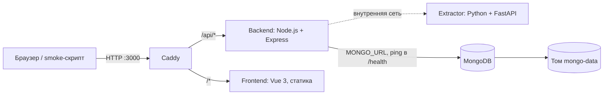

# Optimus — HackAlem AI

## Краткое описание

Сейчас репозиторий содержит инфраструктурную заготовку команды Optimus для HackAlem AI: запуск контейнеров, HTTP-точку входа, MongoDB и скрипты проверки. Она предназначена для подготовки окружения команды и проверки запуска жюри.

Задача из [docs/TASK.md](docs/TASK.md) — сравнение организационной структуры и функций подразделений до и после реорганизации для сотрудников, анализирующих организационные изменения. Пока реализованы каркас приложения и извлечение текста из документов Word, PDF и Excel со ссылками на источник; сравнение и анализ ещё отсутствуют.

## Что реализовано

- Единый [docker-compose.yml](docker-compose.yml) с сервисами Caddy, backend, extractor, frontend и MongoDB, проверками состояния и постоянными томами.
- **Backend** ([services/backend](services/backend)): Node.js + Express. При старте подключается к MongoDB (драйвер `mongodb`), завершает работу с ошибкой, если база недоступна. Маршрут `GET /api/health` выполняет `ping` базы и возвращает `{"status":"ok","db":"ok"}` (или `503` и `{"status":"degraded","db":"unavailable"}`). Маршруты `POST /api/auth/signup`, `POST /api/auth/login`, `POST /api/auth/logout` и `GET /api/auth/me` ([routes/auth.js](services/backend/src/routes/auth.js)) — регистрация и вход по email и паролю: тела запросов проверяются zod-схемами, пароль хешируется `scrypt`, пользователь сохраняется в коллекции `users`, сессия — JWT в httpOnly-cookie `hackalem_session` на 7 дней. Маршрут `POST /api/documents/extract` принимает один документ (multipart, поле `file`, до `MAX_UPLOAD_MB` МБ), передаёт его в extractor и возвращает фрагменты со ссылками на источник (формат ответа — в разделе «Как проверить решение»). Модуль [extractorClient.js](services/backend/src/extractorClient.js) — единственная точка обращения к extractor, с таймаутом 60 с и двумя повторами при недоступности сервиса; неизвестные маршруты `/api/*` возвращают JSON-ошибку `404` в формате `{"error":{"code","message"}}`.
- **Этап 1 конвейера** ([services/backend/src/pipeline/clauses.js](services/backend/src/pipeline/clauses.js)): группирует фрагменты extractor в пункты `{doc_id, side, clause_id, parent_id, text, fragment_ids, ref}`. Подпункты получают номер вида `5.3.2.а`, склеенные в одной строке номера (`3.10.Работники…`) разделяются, только если продолжают нумерацию; номера страниц и хвост «Оглавление»/«Содержание» отбрасываются. На демо-паре: 450 пунктов в ред. 8 и 453 в ред. 9, все пункты контрольного набора (3.4, 5.3, 5.3.5, 5.5.2, 5.6.2, 5.6.3, 5.7.2) присутствуют со ссылками вида «п. 5.6.2, стр. 10, строки 11–12». Остальные этапы (подразделения, функции, сравнение, заключение) не реализованы.
- **API анализа** ([services/backend/src/routes/analyses.js](services/backend/src/routes/analyses.js)), без входа в аккаунт: `POST /api/analyses` принимает multipart-поля `before` и `after` (обязательные) и `regulations` (необязательное), до 10 файлов в поле, до `MAX_UPLOAD_MB` МБ каждый. Тип файла проверяется по содержимому до постановки в очередь: `415 unsupported_format`, `413 file_too_large`, `422 missing_side`, `400 empty_file`. Ответ — `202 {"analysis_id"}`. `POST /api/analyses/demo` запускает то же на встроенной демо-паре. `GET /api/analyses/:id` возвращает документ анализа из MongoDB (`status`: `queued` → `running` → `done`/`failed`, `stage`, `documents[]` с пунктами, `stats`). Поле `pipeline` явно перечисляет выполненные (`implemented: ["clauses"]`) и ещё не реализованные этапы, чтобы пустой результат не выглядел как «отклонений нет». Неизвестный или некорректный id — `404`.
- **Extractor** ([services/extractor](services/extractor)): внутренний сервис на Python + FastAPI. `POST /extract` принимает файл Word (`.docx`), PDF с текстовым слоем или Excel (`.xlsx`, `.xlsm`, `.xls`) и возвращает упорядоченный список фрагментов. У каждого фрагмента есть текст, номер пункта, раздел, точное место в файле и готовая ссылка на источник: для Word — абзац или строка таблицы с восстановленной автонумерацией Word, для PDF — страница и строки, для Excel — лист, строка и диапазон ячеек. Формат определяется по содержимому файла, а не по расширению. Наружу сервис не опубликован, Caddy его не проксирует.
- **Frontend** ([services/frontend](services/frontend)): Vue 3 + Vite, собирается в статические файлы и раздаётся контейнером Caddy. Стартовая страница показывает статус API и базы данных, экран входа и регистрации ([AuthPanel.vue](services/frontend/src/AuthPanel.vue)), а после входа — шапку с именем пользователя, кнопку «Выйти» и заглушку будущего экрана загрузки. Оформление следует дизайн-системе в фирменных цветах Казахтелекома ([services/frontend/DESIGN_SYSTEM.md](services/frontend/DESIGN_SYSTEM.md)): токены и общие компоненты в `src/styles/`, иконки в `src/Icon.vue`.
- Демо-аккаунт для жюри (`demo@example.com` / `demo12345`) создаётся автоматически при старте backend, если его ещё нет ([seed.js](services/backend/src/seed.js)); данные берутся из `DEMO_USER_*`.
- Настройки адреса сайта и опубликованных портов через переменные окружения.
- [scripts/smoke.sh](scripts/smoke.sh): двадцать HTTP-проверок — статус API и доступность MongoDB через `/api/health`, главная страница, ошибка для неизвестного маршрута API, извлечение пунктов из PDF и два отказа на неверный ввод, регистрация, вход, `/api/auth/me` с cookie сессии и три отказа аутентификации (неверный пароль, неверные данные регистрации, запрос без сессии), вход демо-аккаунтом, демо-анализ (постановка в очередь, завершение, пункт 5.6.2 со ссылкой на источник) и три отказа API анализа (неподдерживаемый тип, нет одной из сторон, неизвестный id).
- [scripts/clean-test.sh](scripts/clean-test.sh): проверка закоммиченного состояния в отдельном локальном клоне с настройками из `.env.example`.

Извлечение текста из документов через API, регистрация и вход пользователей работают. Интерфейса загрузки, сравнения комплектов «до/после», анализа оргструктуры и AI-функций пока нет.

## Как работает решение

Доступный сейчас сценарий:

1. Проверяющий копирует `.env.example` в `.env` и запускает Docker Compose.
2. Compose собирает образы backend, extractor и frontend, запускает MongoDB, extractor, затем backend (он подключается к базе при старте), frontend и Caddy и ждёт, пока все пять контейнеров станут healthy.
3. Пользователь открывает `http://localhost:3000/`. Caddy проксирует запрос во frontend; страница «Анализ организационной структуры» запрашивает `/api/health` и `/api/auth/me`, показывает статус API и базы данных и форму входа/регистрации.
4. Запрос `http://localhost:3000/api/health` проксируется в backend, который выполняет `ping` MongoDB и возвращает `{"status":"ok","db":"ok"}`.
5. Пользователь входит демо-аккаунтом `demo@example.com` / `demo12345` (создан при старте backend) или регистрируется (имя, email, пароль не короче 8 символов). Backend проверяет поля, при регистрации хеширует пароль `scrypt` и записывает пользователя в коллекцию `users` (email уникален), затем ставит httpOnly-cookie с JWT. Страница показывает имя пользователя; «Выйти» очищает cookie.
6. Документ отправляется на `POST /api/documents/extract`. Caddy передаёт запрос в backend; backend проверяет размер и наличие файла и пересылает его в extractor по внутренней сети.
7. Extractor определяет формат по содержимому, разбирает документ и возвращает фрагменты: текст, номер пункта, раздел, место в файле и ссылку вида «п. 3.2, абзац 14», «п. 2, стр. 1, строка 2» или «лист «Структура», строка 3». Backend возвращает этот ответ клиенту.
8. Проверяющий запускает smoke-скрипт и получает результаты двадцати HTTP-проверок.

Документы не сохраняются: они обрабатываются в памяти. В MongoDB хранится только коллекция `users` (email, имя, хеш пароля, дата создания) с уникальным индексом по email, который backend создаёт при старте.

## Технологии

- **Docker Compose** — описывает единое окружение для локального запуска и VM.
- **Caddy**, образ `caddy:2-alpine` — единая точка входа: `/api/*` → backend, остальное → frontend; конфигурация находится в [Caddyfile](Caddyfile). Тот же образ раздаёт статику frontend.
- **Node.js 22** (`node:22-alpine`) и **Express 5** — backend API. Выбран потому, что команда знает JavaScript, а один язык на backend и frontend ускоряет работу за 5 часов.
- **Python 3.12** (`python:3.12-slim`), **FastAPI**, **uvicorn** — сервис извлечения текста. Python выбран из-за зрелых библиотек разбора документов. Зависимости зафиксированы в `services/extractor/uv.lock` и ставятся через **uv**.
- **python-docx** (Word), **pdfplumber** на базе pdfminer.six (PDF), **openpyxl** (`.xlsx`/`.xlsm`), **xlrd** (`.xls`), **python-multipart** (загрузка файлов). В образ extractor также входят **pytest** и **httpx** для тестов.
- **jsonwebtoken 9** и **zod 4** — подпись JWT для cookie сессии и валидация тел запросов в backend; пароли хешируются функцией `scrypt` из встроенного модуля `node:crypto`, без дополнительных библиотек.
- **Vue 3** и **Vite 6** — frontend, собирается в статические файлы на этапе сборки образа. Выбран по знакомству команды. Стили написаны на обычном CSS с переменными, без UI-библиотеки.
- **@fontsource/nunito-sans** и **@fontsource/pt-serif** 5.3 — шрифты интерфейса и цитат из документов. Vite включает их в сборку, поэтому страница работает без доступа к внешним CDN.
- **MongoDB**, образ `mongo:8.0` — отдельный сервис базы данных с постоянным томом. Backend подключается к нему через официальный Node.js-драйвер `mongodb` 6.21 (база `hackalem` из `MONGO_URL`).
- **Bash** — язык проверочных скриптов; они также используют стандартные системные утилиты, включая `grep`, `sed` и `mktemp`.
- **curl**, образ `curlimages/curl:8.10.1` — выполняет HTTP-запросы smoke-проверки внутри контейнера.
- **Git** — нужен для получения репозитория и проверки чистого клона.

AI-модели и внешние AI API пока не подключены.

## Архитектура проекта



**Caddy** — единственный сервис с опубликованными портами: по умолчанию HTTP `3000` и HTTPS `3443`. Проксирует `/api/*` в `backend:8000`, остальные запросы — в `frontend:80`. Тома `caddy-data` и `caddy-config` сохраняют его данные и конфигурацию.

Корневой `Caddyfile` включён в образ через [services/caddy/Dockerfile](services/caddy/Dockerfile). После изменения маршрутов `docker compose up --build -d --wait` пересобирает образ и пересоздаёт контейнер Caddy с новой конфигурацией. Это устраняет сохранение старой страницы-заглушки при обновлении файла без перезапуска Caddy. Контекст сборки ограничен конфигурацией и Dockerfile; `.env` в образ не попадает.

**Backend** — контейнер из [services/backend/Dockerfile](services/backend/Dockerfile), порт `8000` внутри сети Compose. Зависимости (`express`, `mongodb`, `multer`, `jsonwebtoken`, `zod`) зафиксированы в `package-lock.json`. При старте открывает подключение к MongoDB и создаёт уникальный индекс `users.email` ([services/backend/src/db.js](services/backend/src/db.js)); healthcheck запрашивает `/health`, который отвечает `200` только при успешном `ping` базы.

**Frontend** — двухэтапный образ из [services/frontend/Dockerfile](services/frontend/Dockerfile): `node:22-alpine` собирает Vite-проект, `caddy:2-alpine` раздаёт `dist/` на порту `80`.

**Extractor** — контейнер из [services/extractor/Dockerfile](services/extractor/Dockerfile), порт `8001` только внутри сети Compose. Разбирает Word, PDF и Excel в фрагменты со ссылками на источник. Healthcheck запрашивает `/health`.

**MongoDB** — независимый контейнер в сети Compose. Порт базы не опубликован на хосте; данные хранятся в `mongo-data`. Его healthcheck выполняет команду `ping`. Backend стартует только после того, как MongoDB станет healthy (`depends_on: service_healthy`), и держит одно подключение на процесс.

## Установка и запуск

Нужны Git, работающий Docker с плагином Compose и Bash со стандартными системными утилитами для проверочных скриптов. Для загрузки репозитория и контейнерных образов требуется доступ к сети. Устанавливать Python, Node.js или зависимости приложения на хост не требуется.

```bash
git clone https://github.com/BAITC-Hacks/hack-0592591a-optimus.git
cd hack-0592591a-optimus
cp .env.example .env
docker compose up --build -d --wait
```

Откройте [локальную страницу](http://localhost:3000). Порты `3000` и `3443` должны быть свободны; при необходимости измените их в `.env` перед запуском.

Все параметры перечислены в [.env.example](.env.example):

- `SITE_ADDRESS=:80` — адрес сайта для Caddy; по умолчанию обычный HTTP. Публичное доменное имя включает автоматический HTTPS при доступных DNS и публичных портах; на VM используются `WEB_PORT=80` и `HTTPS_PORT=443`.
- `WEB_PORT=3000` — порт HTTP на хосте.
- `HTTPS_PORT=3443` — порт HTTPS на хосте; при `SITE_ADDRESS=:80` HTTPS не настроен.
- `MONGO_URL=mongodb://mongo:27017/hackalem` — строка подключения backend к MongoDB внутри сети Compose; имя базы берётся из пути URL. Используется при старте backend и в `/api/health`.
- `MAX_UPLOAD_MB=20` — максимальный размер загружаемого документа в мегабайтах для сервиса извлечения текста.
- `AUTH_SECRET=dev-only-secret-change-me` — секрет подписи JWT для cookie сессии. Значение по умолчанию нужно только для запуска из `.env.example`; на VM задано своё случайное значение. Смена секрета делает все сессии недействительными.
- `DEMO_USER_EMAIL=demo@example.com`, `DEMO_USER_PASSWORD=demo12345`, `DEMO_USER_NAME=Демо` — демо-аккаунт, который backend создаёт при старте, если пользователя с таким email ещё нет (существующий не перезаписывается). Пустой `DEMO_USER_PASSWORD` отключает создание.
- `LLM_PROVIDER=openai` — заготовка выбора провайдера, сейчас не используется.
- `LLM_MODEL` — пустая заготовка имени модели, сейчас не используется.
- `EMBEDDING_MODEL` — пустая заготовка имени модели эмбеддингов для будущего сопоставления функций; сейчас не используется.
- `LLM_BASE_URL` — пустая заготовка адреса AI API, сейчас не используется.
- `OPENAI_API_KEY` — пустая заготовка ключа, сейчас не используется.
- `NVIDIA_API_KEY` — пустая заготовка ключа, сейчас не используется.

Для текущей версии ключи и изменения `.env.example` не нужны. `.env` исключён из Git.

Просмотр состояния и логов:

```bash
docker compose ps
docker compose logs --tail=100 caddy mongo
```

Остановка с сохранением данных:

```bash
docker compose down
```

## Как проверить решение

После запуска выполните:

```bash
./scripts/smoke.sh
```

Ожидаемый результат: двадцать успешных проверок (`backend health`, `mongo reachable`, `frontend is up`, `unknown api route`, `extract pdf clauses`, `reject unsupported type`, `reject missing file`, `signup (or already registered)`, `login`, `reject wrong password`, `reject invalid signup`, `me requires session`, `me with session cookie`, `demo account login`, `demo analysis queued (202)`, `demo analysis done`, `demo clause 5.6.2 with its source`, `analysis rejects unsupported type (415)`, `analysis rejects a missing side (422)`, `unknown analysis id (404)`), итог `passed=20 failed=0` и код завершения `0`. Проверки аутентификации используют синтетический аккаунт `smoke@example.com` с паролем `smoke-pass-123`: первый запуск регистрирует его, последующие получают `email_taken`, что также считается успехом. Скрипт ищет `"status":"ok"` и `"db":"ok"` в ответе `/api/health`, заголовок страницы в ответе `/`, код `not_found` для `/api/does-not-exist`, ссылку `"п. 2, стр. 1, строка 2"` в ответе на PDF, который он сам генерирует, код `unsupported_format` для `.txt` и HTTP `400` для запроса без файла. Демо-анализ он запускает через `POST /api/analyses/demo`, до 60 секунд ждёт `"status":"done"` и проверяет пункт `5.6.2` ред. 8 со ссылкой `п. 5.6.2, стр. 10, строки 11–12`. Выявление отклонений и AI он не проверяет, потому что эти этапы ещё не реализованы.

Извлечение текста из своего документа (`.docx`, `.pdf`, `.xlsx`, `.xlsm`, `.xls`); замените `document.docx` путём к файлу:

```bash
docker run --rm -v "$PWD":/d --add-host=host.docker.internal:host-gateway curlimages/curl:8.10.1 -sS -F "file=@/d/document.docx" http://host.docker.internal:3000/api/documents/extract
```

Форма ответа (сокращено):

```json
{
  "document": {"filename": "Положение.docx", "format": "docx", "size_bytes": 36736, "sha256": "…", "title": "Положение о Департаменте закупок", "paragraphs": 4, "tables": 0},
  "fragments": [
    {"id": "f00003", "kind": "list_item", "text": "1. Планирование закупок.", "clause": "1", "marker": null,
     "section": "Положение о Департаменте закупок › 3. Функции", "location": {"paragraph": 3}, "ref": "п. 1, абзац 3"}
  ],
  "text": "…весь текст документа по фрагментам…",
  "stats": {"fragments": 4, "characters": 120},
  "warnings": []
}
```

`kind` — `heading`, `paragraph`, `list_item`, `table_row` (Word) или `sheet_row` (Excel). `clause` — номер пункта (`"5.3.2"`) или `null`; подпункты `а)`, `б.` получают `clause: null` и букву в `marker` (`"а"`), чтобы backend присоединял их к открытому пункту. `location` зависит от формата: `{"paragraph"}` или `{"table","row","cells"}` для Word, `{"page","line_start","line_end"}` для PDF, `{"sheet","row","range","cells"}` для Excel. Ошибки возвращаются как `{"error":{"code","message"}}`: `400 bad_request`/`empty_file`, `413 file_too_large`/`document_too_large`, `415 unsupported_format`, `422 unreadable_document`, `503 extractor_unavailable`, `504 extractor_timeout`.

Регистрация и вход через API (пример для Bash и Zsh). Cookie хранится во временной директории вне репозитория и удаляется после проверки. Функция передаёт аргументы Docker без повторного разбора кавычек; пути с пробелами также поддерживаются.

```bash
(
  AUTH_COOKIE_DIR="$(mktemp -d)"
  trap 'if [ -f "$AUTH_COOKIE_DIR/jar" ]; then unlink "$AUTH_COOKIE_DIR/jar"; fi; rmdir "$AUTH_COOKIE_DIR"' EXIT
  api_curl() {
    docker run --rm --user "$(id -u):$(id -g)" \
      -v "$AUTH_COOKIE_DIR:/cookies" \
      --add-host=host.docker.internal:host-gateway \
      curlimages/curl:8.10.1 -sS -w '\nHTTP %{http_code}\n' "$@"
  }
  api_curl -c /cookies/jar -H 'content-type: application/json' \
    -d '{"name":"Тест README","email":"readme-demo@example.com","password":"example-pass-123"}' \
    http://host.docker.internal:3000/api/auth/signup
  api_curl -c /cookies/jar -H 'content-type: application/json' \
    -d '{"email":"readme-demo@example.com","password":"example-pass-123"}' \
    http://host.docker.internal:3000/api/auth/login
  api_curl -b /cookies/jar http://host.docker.internal:3000/api/auth/me
)
```

Первый запуск возвращает HTTP `201`, `200`, `200`. При повторном запуске регистрация возвращает `409 email_taken`, а вход и `/me` — `200`. Это отдельный синтетический аккаунт для проверки примера, не личные учётные данные. При другом HTTP-порте замените `3000` во всех трёх адресах.

Успешные ответы — `{"user":{"id","email","name","createdAt"}}` (`201` для регистрации, `200` для входа и `/me`), `logout` отвечает `204`. Ошибки: `401 invalid_credentials` (неверный email или пароль), `401 unauthorized` (нет или истекла сессия), `409 email_taken`, `422 validation_error` (в `message` — поле и причина). Хеш пароля API не возвращает. То же самое доступно в браузере на стартовой странице.

Если `WEB_PORT` изменён в `.env`, передайте тот же порт скрипту явно: скрипт сам `.env` не читает. Например, для порта `3100`:

```bash
WEB_PORT=3100 ./scripts/smoke.sh
```

Тесты сервиса извлечения (тестовые Word, Excel и PDF создаются в коде теста, ключи не нужны):

```bash
docker compose run --rm --no-deps extractor pytest -q
```

Они проверяют: восстановление автонумерации Word, включая начало с заданного номера (`lvlOverride`/`startOverride`), независимые списки и многоуровневые пункты; разделы по заголовкам, буквенные подпункты (`marker` вместо `clause`) в Word и PDF, строки таблиц Word, строки и диапазоны ячеек Excel, склейку перенесённых строк PDF и ссылки «п. N, стр. N, строки N–N», предупреждение для PDF без текстового слоя, определение формата по содержимому, а также отказ на `.txt`, `.doc`, пустой, повреждённый файл и zip-бомбу.

Отдельный регрессионный тест удерживает определение формата или разбор файла в рабочем потоке и проверяет, что `/health` отвечает до завершения обработки. Он защищает от возврата синхронного разбора в основной цикл сервера.

Демо-анализ через API (сейчас выполняется только этап 1 — сборка пунктов; занимает около 10 секунд):

```bash
docker run --rm --add-host=host.docker.internal:host-gateway curlimages/curl:8.10.1 -sS -X POST http://host.docker.internal:3000/api/analyses/demo
```

Ответ — `{"analysis_id":"a_…"}`. Подставьте id в запрос статуса:

```bash
docker run --rm --add-host=host.docker.internal:host-gateway curlimages/curl:8.10.1 -sS http://host.docker.internal:3000/api/analyses/a_XXXXXXXXXXXX
```

Ожидается `"status":"done"`, `"pipeline":{"implemented":["clauses"],…}`, `"stats":{"clauses_before":450,"clauses_after":453,…}`, а в `documents[].clauses` — например, пункт `5.6.2` со ссылкой `п. 5.6.2, стр. 10, строки 11–12` (ред. 8).

Тесты backend (ключи и запущенные сервисы не нужны):

```bash
docker compose run --rm --no-deps backend node --test
```

Они проверяют этап 1 конвейера — сборку пунктов из фрагментов ([clauses.js](services/backend/src/pipeline/clauses.js)) — на фрагменте реального ответа extractor для демо-документа ред. 9 ([test/fixtures](services/backend/test/fixtures)): разделение склеенных номеров (`б. Руководитель направления. 3.10.Рабочие места…` → пункты 3.9.б, 3.10, 3.11), пункт 3.12 без пробела после номера, подпункты как дочерние пункты `5.3.2.а`, удаление номеров страниц и хвоста «Оглавление», проверку последовательности номеров (ссылка «см. п. 3.» не становится пунктом) и строки Excel как отдельные записи.

Проверка запуска из чистого локального клона:

```bash
./scripts/clean-test.sh
```

Этот скрипт клонирует **закоммиченное** состояние текущего репозитория во временную директорию, копирует `.env.example`, использует отдельный Compose-проект и порты `3900`/`3901`, вызывает сборку без кеша, запускает сервисы и выполняет smoke-проверку. После завершения удаляет тестовые контейнеры, тома и временный клон. Ожидаемая последняя строка: `>> Clean-clone test passed`.

Незакоммиченные изменения в эту проверку не попадают. При занятых тестовых портах задайте другой базовый порт через `CLEAN_TEST_PORT`.

## Данные и интеграции

В репозитории и образе backend (`/app/demo`) поставляются два обезличенных PDF «Положение о внутреннем аудите АО „Компания“», по 25 страниц каждый:

- **До:** [редакция 8](services/backend/demo/before/redakciya_8.pdf), исходное имя `Положение_о_внутреннем_аудите_редакция_8_обезличено.docx.pdf`. SHA-256: `2257b6fa007c4d03ae336f556a93434bd7220292c8394bac6f13e190e1017bb1`.
- **После:** [редакция 9](services/backend/demo/after/redakciya_9.pdf), исходное имя `Положение_о_внутреннем_аудите_редакция_9_обезличено.docx.pdf`. SHA-256: `84eb8e79a0eccb9e7c0a922e38301b1210bfb4e6d15ac93feacfce5e23fed3a5`.

Источник — файлы, предоставленные пользователем 23.09.2026 с явным поручением включить их в репозиторий как демоданные. Байты оригиналов сохранены; изменены только имена файлов. Отдельная лицензия на распространение в документах не указана; открытая лицензия им не приписывается.

После запуска Compose проверить извлечение обоих PDF без ключей и входа можно командой ниже. Она читает файлы из образа backend и вызывает существующий API. Ожидается: ред. 8 — 527 фрагментов, 337 с номером пункта; ред. 9 — 528 фрагментов, 325 с номером пункта; оба ответа HTTP 200, по 25 страниц, без предупреждений.

```bash
docker compose exec -T backend node --input-type=module <<'JS'
import { readFile } from 'node:fs/promises';
import { createHash } from 'node:crypto';
import assert from 'node:assert/strict';
for (const [file, count, clauses] of [
  ['before/redakciya_8.pdf', 527, 337],
  ['after/redakciya_9.pdf', 528, 325],
]) {
  const data = await readFile(`/app/demo/${file}`);
  const form = new FormData();
  form.append('file', new Blob([data], { type: 'application/pdf' }), file.split('/').pop());
  const response = await fetch('http://localhost:8000/api/documents/extract', {
    method: 'POST', body: form, signal: AbortSignal.timeout(60000),
  });
  assert.equal(response.status, 200);
  const result = await response.json();
  assert.equal(result.document.sha256, createHash('sha256').update(data).digest('hex'));
  assert.equal(result.document.pages, 25);
  assert.equal(result.stats.fragments, count);
  assert.equal(result.fragments.filter(f => f.clause !== null).length, clauses);
  assert.deepEqual(result.warnings, []);
  console.log(`${file}: HTTP 200, 25 страниц, ${count} фрагментов, ${clauses} с номером пункта`);
}
JS
```

Это проверка извлечения текста, а не автоматического сравнения оргструктуры. Ожидаемые находки из [docs/TASK.md](docs/TASK.md) ещё требуют проверки после реализации анализа. Тесты extractor дополнительно создают небольшие синтетические Word/Excel/PDF в памяти; smoke-скрипт генерирует свой PDF.

Backend при старте создаёт в базе `hackalem` уникальный индекс по `users.email` и синтетический демо-аккаунт `demo@example.com` (см. «Доступ для жюри»); остальные пользователи появляются при регистрации. Демо-аккаунт предназначен только для входа и не содержит документов или результатов анализа. Вызовов внешних API и интеграций с AI-провайдерами нет; соответствующие переменные окружения только зарезервированы.

Внешние зависимости запуска — GitHub для клонирования и реестры контейнеров для получения образов. Caddy поддерживает автоматические сертификаты при настройке публичного домена; для локального HTTP они не требуются.

## Ограничения

- ТЗ и критерии оценки записаны в `docs/TASK.md`, но обязательные функции анализа документов ещё не реализованы.
- Контрольные PDF включены и проверены на извлечение текста; демонстрационный анализ и автоматическая проверка ожидаемых находок из `docs/TASK.md` пока отсутствуют.
- Есть стартовый Vue-интерфейс, API проверки состояния и API извлечения текста из документов. Интерфейс загрузки, сравнение комплектов «до/после», основной продуктовый сценарий и AI-обработка отсутствуют.
- Из моделей данных есть только пользователь (`users`); результаты извлечения и анализа не сохраняются; вызовов LLM пока нет.
- Аутентификация минимальная: нет восстановления пароля, подтверждения email, ограничения числа попыток входа и ролей. Защищённых маршрутов пока нет: `/api/documents/extract` доступен без входа. `AUTH_SECRET` по умолчанию подходит только для локального запуска.
- Smoke-проверка охватывает двадцать HTTP-запросов, включая доступность MongoDB, извлечение текста из PDF, аутентификацию и демо-анализ до этапа сборки пунктов. Подразделения, сопоставление функций, отклонения и заключение она не проверяет, потому что эти этапы ещё не реализованы.
- Извлечение обрабатывает один файл за запрос; результаты не сохраняются.
- Извлечение текста: сканированные PDF без текстового слоя не распознаются (OCR нет, возвращается предупреждение); формат `.doc` не поддерживается — нужно пересохранить в `.docx`. Автонумерация Word учитывает формат, шаблон и переопределения уровня и начала нумерации (`lvlOverride`/`startOverride`); специальные правила перезапуска `lvlRestart` пока не поддержаны. Кириллические PDF в автотестах не проверялись.
- Теги контейнерных образов не закреплены по digest; `caddy:2-alpine` также не фиксирует minor-версию.

## Развёрнутая версия

В [AGENTS.md](AGENTS.md) указан адрес VM: [демонстрационная версия](https://hackalem-ai-wg.germanywestcentral.cloudapp.azure.com). Там же описано автоматическое обновление после push в `main`.

Доступность адреса и состояние удалённого деплоя этой документацией не подтверждаются: скрипта развёртывания VM в репозитории нет. Локальный запуск остаётся самостоятельным способом проверки.

## Доступ для жюри

Для запуска текущей заготовки не нужны аккаунты команды, платные подписки или API-ключи. Нужны доступ к репозиторию и возможность скачать контейнерные образы.

Демо-аккаунт для входа в интерфейс (создаётся автоматически при старте backend, локально и на развёрнутой версии):

| Поле | Значение |
|---|---|
| Email (логин) | `demo@example.com` |
| Пароль | `demo12345` |

Аккаунт синтетический и не связан ни с какими внешними сервисами. При желании можно зарегистрировать любой другой аккаунт на стартовой странице. Доступ к будущим AI-функциям пока не настроен, поскольку сами функции отсутствуют.

## Надёжность и безопасность

Все пять сервисов имеют healthcheck и политику перезапуска `unless-stopped`. Наружу публикуются только порты Caddy. MongoDB не имеет опубликованного порта; аутентификация базы в текущем Compose не настроена. Backend принимает JSON не больше 1 МБ и один загружаемый файл не больше `MAX_UPLOAD_MB` (по умолчанию 20 МБ); extractor повторно проверяет размер, отклоняет архивы с распакованным размером больше 200 МБ, PDF больше 300 страниц и определяет формат по содержимому, а не по расширению. Разбор выполняется в отдельном потоке, поэтому `/health` extractor отвечает и во время обработки большого документа. Backend скрывает заголовок `X-Powered-By` и отвечает на ошибки JSON-объектом без трассировки стека. Проверка `/api/health` выполняет `ping` MongoDB с таймаутом 2 с и возвращает `503`, если база недоступна; при недоступной базе на старте backend завершается и перезапускается политикой `unless-stopped`.

Аутентификация: пароли хранятся как `scrypt`-хеши (соль 16 байт, ключ 64 байта, сравнение за постоянное время) и никогда не возвращаются API. Сессия — JWT HS256 в cookie `hackalem_session` с флагами `HttpOnly`, `SameSite=Lax` и `Secure` за HTTPS (backend доверяет `X-Forwarded-Proto` от Caddy, других входов у него нет). Тела запросов проверяются строгими zod-схемами (лишние поля отклоняются), в фильтры MongoDB попадают только приведённые к строке значения.

Файлы `.env`, `.env.*` (кроме `.env.example`), `*.pem` и `*.key` исключены через `.gitignore`. Загруженные документы обрабатываются в памяти и не сохраняются на диск или в базу.

## Сторонние и заранее подготовленные материалы

- Подготовленный до мероприятия шаблон окружения обозначен в истории Git коммитом `a6d411c` (`chore: development environment template (prepared before the event)`). В него входят инструкции агентов, Compose, Caddyfile, шаблоны документации и скрипты проверки.
- Сторонние компоненты текущего окружения: Docker/Compose, Caddy, MongoDB, curl и их контейнерные образы. Файлы лицензий этих компонентов в репозиторий не включены; условия поставки определяются соответствующими компонентами и образами.
- Прикладные библиотеки backend: `express` 5 и официальный драйвер `mongodb` 6 для Node.js (устанавливаются при сборке образа из `package-lock.json`).
- Библиотека backend: multer 2 (MIT) — приём multipart-загрузки файлов.
- Библиотеки backend: jsonwebtoken 9 (MIT) — подпись и проверка JWT сессии; zod 4 (MIT) — валидация входных данных.
- Библиотеки frontend: vue 3 и vite 6 (MIT); шрифты Nunito Sans и PT Serif из пакетов @fontsource/nunito-sans и @fontsource/pt-serif 5.3 (SIL Open Font License 1.1). Иконки в `src/Icon.vue` нарисованы в стиле Lucide и написаны вручную, без библиотеки. Логотип OrgScope — условный знак, а не логотип Казахтелекома.
- Библиотеки сервиса extractor: FastAPI, uvicorn, python-multipart (BSD/MIT), python-docx (MIT), pdfplumber и pdfminer.six (MIT), openpyxl (MIT), xlrd (BSD), pytest (MIT), httpx (BSD). Полный список транзитивных зависимостей — в `services/extractor/uv.lock`.
- Два предоставленных пользователем обезличенных PDF включены без изменений; происхождение и контрольные суммы приведены в разделе «Данные и интеграции». Внешние модели не добавлены.
- В репозитории есть инструкции для OpenAI Codex и Claude Code. Эта редакция документации подготовлена с помощью OpenAI Codex. Сервис extractor, маршрут извлечения документов, подключение MongoDB и аутентификация написаны с помощью Claude Code.

## Команда

Название команды — Optimus (из имени репозитория). Состав команды и распределение продуктовых задач в текущих файлах не зафиксированы. Авторство изменений доступно в истории Git.
