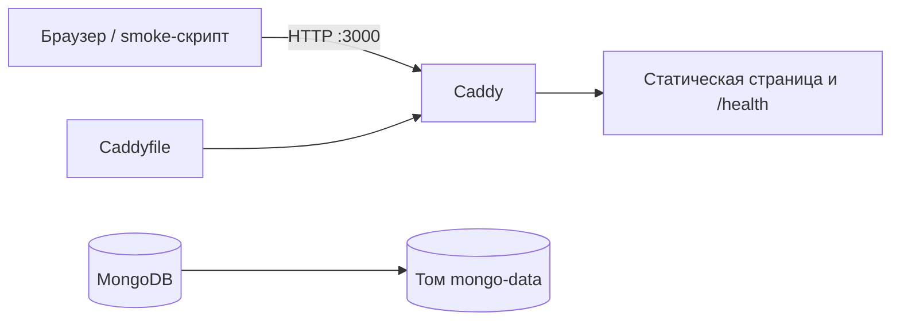

# Optimus — HackAlem AI

## Краткое описание

Сейчас репозиторий содержит инфраструктурную заготовку команды Optimus для HackAlem AI: запуск контейнеров, HTTP-точку входа, MongoDB и скрипты проверки. Она предназначена для подготовки окружения команды и проверки запуска жюри.

Продуктовая задача, проблема конечного пользователя и целевая аудитория пока не определены в репозитории: [docs/TASK.md](docs/TASK.md) содержит незаполненный шаблон ТЗ. Прикладное решение ещё не реализовано.

## Что реализовано

- Единый [docker-compose.yml](docker-compose.yml) с сервисами Caddy и MongoDB, проверками состояния и постоянными томами.
- HTTP-маршрут `/health`, возвращающий `ok`, и стартовая текстовая страница Caddy.
- Настройки адреса сайта и опубликованных портов через переменные окружения.
- [scripts/smoke.sh](scripts/smoke.sh): проверка ответа `/health` и HTTP-статуса главной страницы.
- [scripts/clean-test.sh](scripts/clean-test.sh): проверка закоммиченного состояния в отдельном локальном клоне с настройками из `.env.example`.

Это проверка инфраструктуры. Пользовательского интерфейса приложения, API бизнес-логики и AI-функций пока нет.

## Как работает решение

Доступный сейчас сценарий:

1. Проверяющий копирует `.env.example` в `.env` и запускает Docker Compose.
2. Compose запускает Caddy и MongoDB и проверяет состояние обоих контейнеров.
3. Пользователь открывает `http://localhost:3000/`. Caddy возвращает текст: `HackAlem AI: pipeline works. The application replaces this page.`
4. Запрос `http://localhost:3000/health` возвращает `ok`.
5. Проверяющий запускает smoke-скрипт и получает результаты двух HTTP-проверок.

Входные данные текущего сценария — HTTP-запросы. Результат — статические ответы Caddy. Обработки пользовательских данных и обращений к MongoDB из приложения пока нет.

## Технологии

- **Docker Compose** — описывает единое окружение для локального запуска и VM.
- **Caddy**, образ `caddy:2-alpine` — обслуживает текущую страницу и `/health`; конфигурация находится в [Caddyfile](Caddyfile).
- **MongoDB**, образ `mongo:8.0` — отдельный сервис базы данных с постоянным томом. Прикладной код его пока не использует.
- **Bash** — язык проверочных скриптов; они также используют стандартные системные утилиты, включая `grep`, `sed` и `mktemp`.
- **curl**, образ `curlimages/curl:8.10.1` — выполняет HTTP-запросы smoke-проверки внутри контейнера.
- **Git** — нужен для получения репозитория и проверки чистого клона.

Фреймворки backend/frontend, AI-модели и внешние AI API пока не подключены. Предлагаемый стек из AGENTS.md не является текущей реализацией.

## Архитектура проекта



**Caddy** — единственный сервис с опубликованными портами: по умолчанию HTTP `3000` и HTTPS `3443`. Сейчас он возвращает статические ответы напрямую. Проксирование в API и web-сервис описано только в комментариях Caddyfile. Тома `caddy-data` и `caddy-config` сохраняют его данные и конфигурацию.

**MongoDB** — независимый контейнер в сети Compose. Порт базы не опубликован на хосте; данные хранятся в `mongo-data`. Его healthcheck выполняет команду `ping`. Связи между Caddy и MongoDB в текущей реализации нет.

Каталога `services/`, Dockerfile приложения и файлов прикладных зависимостей пока нет.

## Установка и запуск

Нужны Git, работающий Docker с плагином Compose и Bash со стандартными системными утилитами для проверочных скриптов. Для загрузки репозитория и контейнерных образов требуется доступ к сети. Устанавливать Python, Node.js или зависимости приложения на хост не требуется.

```bash
git clone https://github.com/BAITC-Hacks/hack-0592591a-optimus.git
cd hack-0592591a-optimus
cp .env.example .env
docker compose up --build -d --wait
```

Откройте [локальную страницу](http://localhost:3000). Порты `3000` и `3443` должны быть свободны; при необходимости измените их в `.env` перед запуском.

Все параметры перечислены в [.env.example](.env.example):

- `SITE_ADDRESS=:80` — адрес сайта для Caddy; по умолчанию обычный HTTP. Публичное доменное имя включает автоматический HTTPS при доступных DNS и публичных портах; на VM используются `WEB_PORT=80` и `HTTPS_PORT=443`.
- `WEB_PORT=3000` — порт HTTP на хосте.
- `HTTPS_PORT=3443` — порт HTTPS на хосте; при `SITE_ADDRESS=:80` HTTPS не настроен.
- `MONGO_URL=mongodb://mongo:27017/hackalem` — заготовка строки подключения для будущего приложения, сейчас не используется.
- `LLM_PROVIDER=openai` — заготовка выбора провайдера, сейчас не используется.
- `LLM_MODEL` — пустая заготовка имени модели, сейчас не используется.
- `LLM_BASE_URL` — пустая заготовка адреса AI API, сейчас не используется.
- `OPENAI_API_KEY` — пустая заготовка ключа, сейчас не используется.
- `NVIDIA_API_KEY` — пустая заготовка ключа, сейчас не используется.

Для текущей версии ключи и изменения `.env.example` не нужны. `.env` исключён из Git.

Просмотр состояния и логов:

```bash
docker compose ps
docker compose logs --tail=100 caddy mongo
```

Остановка с сохранением данных:

```bash
docker compose down
```

## Как проверить решение

После запуска выполните:

```bash
./scripts/smoke.sh
```

Ожидаемый результат текущего сценария: две успешные проверки (`health endpoint`, `entrypoint is up`), итог `passed=2 failed=0` и код завершения `0`. Скрипт ищет `ok` в ответе `/health` и проверяет HTTP `200` для `/`; он не проверяет бизнес-логику, AI или обработку некорректных данных.

Если `WEB_PORT` изменён в `.env`, передайте тот же порт скрипту явно: скрипт сам `.env` не читает. Например, для порта `3100`:

```bash
WEB_PORT=3100 ./scripts/smoke.sh
```

Проверка запуска из чистого локального клона:

```bash
./scripts/clean-test.sh
```

Этот скрипт клонирует **закоммиченное** состояние текущего репозитория во временную директорию, копирует `.env.example`, использует отдельный Compose-проект и порты `3900`/`3901`, вызывает сборку без кеша, запускает сервисы и выполняет smoke-проверку. После завершения удаляет тестовые контейнеры, тома и временный клон. Ожидаемая последняя строка: `>> Clean-clone test passed`. Сейчас сервисы используют готовые образы, поэтому прикладных образов для сборки нет.

Незакоммиченные изменения в эту проверку не попадают. При занятых тестовых портах задайте другой базовый порт через `CLEAN_TEST_PORT`.

## Данные и интеграции

Датасетов, демонстрационных записей, загрузчиков данных и seed-команд в репозитории нет. MongoDB запускается без прикладных данных. Вызовов внешних API и интеграций с AI-провайдерами нет; соответствующие переменные окружения только зарезервированы.

Внешние зависимости запуска — GitHub для клонирования и реестры контейнеров для получения образов. Caddy поддерживает автоматические сертификаты при настройке публичного домена; для локального HTTP они не требуются.

## Ограничения

- ТЗ, трек и критерии оценки в `docs/TASK.md` не заполнены; соответствие требованиям задачи пока оценить нельзя.
- Прикладной backend, frontend, основной продуктовый сценарий и AI-обработка отсутствуют.
- Стартовая страница — явная заглушка инфраструктуры; фраза `pipeline works` в ней сама по себе не подтверждает работу деплоя или приложения.
- Нет моделей данных, валидации пользовательского ввода, загрузки файлов и обработки ошибок внешних API.
- Smoke-проверка охватывает только два HTTP-запроса. Успешный результат не подтверждает работу будущего продукта или сохранение данных в MongoDB.
- Теги контейнерных образов не закреплены по digest; `caddy:2-alpine` также не фиксирует minor-версию.

## Развёрнутая версия

В [AGENTS.md](AGENTS.md) указан адрес VM: [демонстрационная версия](https://hackalem-ai-wg.germanywestcentral.cloudapp.azure.com). Там же описано автоматическое обновление после push в `main`.

Доступность адреса и состояние удалённого деплоя этой документацией не подтверждаются: скрипта развёртывания VM в репозитории нет. Локальный запуск остаётся самостоятельным способом проверки.

## Доступ для жюри

Для запуска текущей заготовки не нужны аккаунты команды, платные подписки или API-ключи. Нужны доступ к репозиторию и возможность скачать контейнерные образы. Доступ к будущим AI-функциям пока не настроен, поскольку сами функции отсутствуют.

## Надёжность и безопасность

Оба сервиса имеют healthcheck и политику перезапуска `unless-stopped`. Наружу публикуются только порты Caddy. MongoDB не имеет опубликованного порта; аутентификация базы в текущем Compose не настроена. Проверка `/health` — статический ответ Caddy, она не проверяет MongoDB.

Файлы `.env`, `.env.*` (кроме `.env.example`), `*.pem` и `*.key` исключены через `.gitignore`. Реализации защиты прикладного API пока нет, поскольку API отсутствует.

## Сторонние и заранее подготовленные материалы

- Подготовленный до мероприятия шаблон окружения обозначен в истории Git коммитом `a6d411c` (`chore: development environment template (prepared before the event)`). В него входят инструкции агентов, Compose, Caddyfile, шаблоны документации и скрипты проверки.
- Сторонние компоненты текущего окружения: Docker/Compose, Caddy, MongoDB, curl и их контейнерные образы. Файлы лицензий этих компонентов в репозиторий не включены; условия поставки определяются соответствующими компонентами и образами.
- Внешние модели, датасеты и прикладные библиотеки не добавлены.
- В репозитории есть инструкции для OpenAI Codex и Claude Code. Эта редакция документации подготовлена с помощью OpenAI Codex.

## Команда

Название команды — Optimus (из имени репозитория). Состав команды и распределение продуктовых задач в текущих файлах не зафиксированы. Авторство изменений доступно в истории Git.
