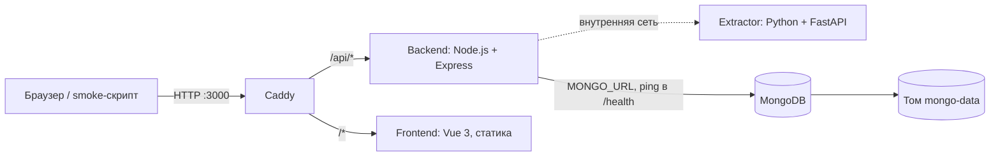

# Optimus — HackAlem AI

## Краткое описание

Сейчас репозиторий содержит инфраструктурную заготовку команды Optimus для HackAlem AI: запуск контейнеров, HTTP-точку входа, MongoDB и скрипты проверки. Она предназначена для подготовки окружения команды и проверки запуска жюри.

Задача из [docs/TASK.md](docs/TASK.md) — сравнение организационной структуры и функций подразделений до и после реорганизации для сотрудников, анализирующих организационные изменения. Пока реализованы каркас приложения и извлечение текста из документов Word, PDF и Excel со ссылками на источник; сравнение и анализ ещё отсутствуют.

## Что реализовано

- Единый [docker-compose.yml](docker-compose.yml) с сервисами Caddy, backend, extractor, frontend и MongoDB, проверками состояния и постоянными томами.
- **Backend** ([services/backend](services/backend)): Node.js + Express. При старте подключается к MongoDB (драйвер `mongodb`), завершает работу с ошибкой, если база недоступна. Маршрут `GET /api/health` выполняет `ping` базы и возвращает `{"status":"ok","db":"ok"}` (или `503` и `{"status":"degraded","db":"unavailable"}`). Маршрут `POST /api/documents/extract` принимает один документ (multipart, поле `file`, до `MAX_UPLOAD_MB` МБ), передаёт его в extractor и возвращает фрагменты со ссылками на источник (формат ответа — в разделе «Как проверить решение»). Модуль [extractorClient.js](services/backend/src/extractorClient.js) — единственная точка обращения к extractor, с таймаутом 60 с и двумя повторами при недоступности сервиса; неизвестные маршруты `/api/*` возвращают JSON-ошибку `404` в формате `{"error":{"code","message"}}`.
- **Extractor** ([services/extractor](services/extractor)): внутренний сервис на Python + FastAPI. `POST /extract` принимает файл Word (`.docx`), PDF с текстовым слоем или Excel (`.xlsx`, `.xlsm`, `.xls`) и возвращает упорядоченный список фрагментов. У каждого фрагмента есть текст, номер пункта, раздел, точное место в файле и готовая ссылка на источник: для Word — абзац или строка таблицы с восстановленной автонумерацией Word, для PDF — страница и строки, для Excel — лист, строка и диапазон ячеек. Формат определяется по содержимому файла, а не по расширению. Наружу сервис не опубликован, Caddy его не проксирует.
- **Frontend** ([services/frontend](services/frontend)): Vue 3 + Vite, собирается в статические файлы и раздаётся контейнером Caddy. Стартовая страница показывает статус API и базы данных.
- Настройки адреса сайта и опубликованных портов через переменные окружения.
- [scripts/smoke.sh](scripts/smoke.sh): семь HTTP-проверок — статус API и доступность MongoDB через `/api/health`, главная страница, ошибка для неизвестного маршрута API, извлечение пунктов из PDF и два отказа на неверный ввод.
- [scripts/clean-test.sh](scripts/clean-test.sh): проверка закоммиченного состояния в отдельном локальном клоне с настройками из `.env.example`.

Извлечение текста из документов через API работает. Интерфейса загрузки, сравнения комплектов «до/после», анализа оргструктуры и AI-функций пока нет.

## Как работает решение

Доступный сейчас сценарий:

1. Проверяющий копирует `.env.example` в `.env` и запускает Docker Compose.
2. Compose собирает образы backend, extractor и frontend, запускает MongoDB, extractor, затем backend (он подключается к базе при старте), frontend и Caddy и ждёт, пока все пять контейнеров станут healthy.
3. Пользователь открывает `http://localhost:3000/`. Caddy проксирует запрос во frontend; страница «Анализ организационной структуры» запрашивает `/api/health` и показывает статус API и базы данных.
4. Запрос `http://localhost:3000/api/health` проксируется в backend, который выполняет `ping` MongoDB и возвращает `{"status":"ok","db":"ok"}`.
5. Документ отправляется на `POST /api/documents/extract`. Caddy передаёт запрос в backend; backend проверяет размер и наличие файла и пересылает его в extractor по внутренней сети.
6. Extractor определяет формат по содержимому, разбирает документ и возвращает фрагменты: текст, номер пункта, раздел, место в файле и ссылку вида «п. 3.2, абзац 14», «п. 2, стр. 1, строка 2» или «лист «Структура», строка 3». Backend возвращает этот ответ клиенту.
7. Проверяющий запускает smoke-скрипт и получает результаты семи HTTP-проверок.

Документы не сохраняются: они обрабатываются в памяти. Обращение к MongoDB ограничено проверкой соединения; прикладных коллекций пока нет.

## Технологии

- **Docker Compose** — описывает единое окружение для локального запуска и VM.
- **Caddy**, образ `caddy:2-alpine` — единая точка входа: `/api/*` → backend, остальное → frontend; конфигурация находится в [Caddyfile](Caddyfile). Тот же образ раздаёт статику frontend.
- **Node.js 22** (`node:22-alpine`) и **Express 5** — backend API. Выбран потому, что команда знает JavaScript, а один язык на backend и frontend ускоряет работу за 5 часов.
- **Python 3.12** (`python:3.12-slim`), **FastAPI**, **uvicorn** — сервис извлечения текста. Python выбран из-за зрелых библиотек разбора документов. Зависимости зафиксированы в `services/extractor/uv.lock` и ставятся через **uv**.
- **python-docx** (Word), **pdfplumber** на базе pdfminer.six (PDF), **openpyxl** (`.xlsx`/`.xlsm`), **xlrd** (`.xls`), **python-multipart** (загрузка файлов). В образ extractor также входят **pytest** и **httpx** для тестов.
- **Vue 3** и **Vite 6** — frontend, собирается в статические файлы на этапе сборки образа. Выбран по знакомству команды.
- **MongoDB**, образ `mongo:8.0` — отдельный сервис базы данных с постоянным томом. Backend подключается к нему через официальный Node.js-драйвер `mongodb` 6.21 (база `hackalem` из `MONGO_URL`).
- **Bash** — язык проверочных скриптов; они также используют стандартные системные утилиты, включая `grep`, `sed` и `mktemp`.
- **curl**, образ `curlimages/curl:8.10.1` — выполняет HTTP-запросы smoke-проверки внутри контейнера.
- **Git** — нужен для получения репозитория и проверки чистого клона.

AI-модели и внешние AI API пока не подключены.

## Архитектура проекта



**Caddy** — единственный сервис с опубликованными портами: по умолчанию HTTP `3000` и HTTPS `3443`. Проксирует `/api/*` в `backend:8000`, остальные запросы — в `frontend:80`. Тома `caddy-data` и `caddy-config` сохраняют его данные и конфигурацию.

Корневой `Caddyfile` включён в образ через [services/caddy/Dockerfile](services/caddy/Dockerfile). После изменения маршрутов `docker compose up --build -d --wait` пересобирает образ и пересоздаёт контейнер Caddy с новой конфигурацией. Это устраняет сохранение старой страницы-заглушки при обновлении файла без перезапуска Caddy. Контекст сборки ограничен конфигурацией и Dockerfile; `.env` в образ не попадает.

**Backend** — контейнер из [services/backend/Dockerfile](services/backend/Dockerfile), порт `8000` внутри сети Compose. Зависимости (`express`, `mongodb`) зафиксированы в `package-lock.json`. При старте открывает подключение к MongoDB ([services/backend/src/db.js](services/backend/src/db.js)); healthcheck запрашивает `/health`, который отвечает `200` только при успешном `ping` базы.

**Frontend** — двухэтапный образ из [services/frontend/Dockerfile](services/frontend/Dockerfile): `node:22-alpine` собирает Vite-проект, `caddy:2-alpine` раздаёт `dist/` на порту `80`.

**Extractor** — контейнер из [services/extractor/Dockerfile](services/extractor/Dockerfile), порт `8001` только внутри сети Compose. Разбирает Word, PDF и Excel в фрагменты со ссылками на источник. Healthcheck запрашивает `/health`.

**MongoDB** — независимый контейнер в сети Compose. Порт базы не опубликован на хосте; данные хранятся в `mongo-data`. Его healthcheck выполняет команду `ping`. Backend стартует только после того, как MongoDB станет healthy (`depends_on: service_healthy`), и держит одно подключение на процесс.

## Установка и запуск

Нужны Git, работающий Docker с плагином Compose и Bash со стандартными системными утилитами для проверочных скриптов. Для загрузки репозитория и контейнерных образов требуется доступ к сети. Устанавливать Python, Node.js или зависимости приложения на хост не требуется.

```bash
git clone https://github.com/BAITC-Hacks/hack-0592591a-optimus.git
cd hack-0592591a-optimus
cp .env.example .env
docker compose up --build -d --wait
```

Откройте [локальную страницу](http://localhost:3000). Порты `3000` и `3443` должны быть свободны; при необходимости измените их в `.env` перед запуском.

Все параметры перечислены в [.env.example](.env.example):

- `SITE_ADDRESS=:80` — адрес сайта для Caddy; по умолчанию обычный HTTP. Публичное доменное имя включает автоматический HTTPS при доступных DNS и публичных портах; на VM используются `WEB_PORT=80` и `HTTPS_PORT=443`.
- `WEB_PORT=3000` — порт HTTP на хосте.
- `HTTPS_PORT=3443` — порт HTTPS на хосте; при `SITE_ADDRESS=:80` HTTPS не настроен.
- `MONGO_URL=mongodb://mongo:27017/hackalem` — строка подключения backend к MongoDB внутри сети Compose; имя базы берётся из пути URL. Используется при старте backend и в `/api/health`.
- `MAX_UPLOAD_MB=20` — максимальный размер загружаемого документа в мегабайтах для сервиса извлечения текста.
- `LLM_PROVIDER=openai` — заготовка выбора провайдера, сейчас не используется.
- `LLM_MODEL` — пустая заготовка имени модели, сейчас не используется.
- `LLM_BASE_URL` — пустая заготовка адреса AI API, сейчас не используется.
- `OPENAI_API_KEY` — пустая заготовка ключа, сейчас не используется.
- `NVIDIA_API_KEY` — пустая заготовка ключа, сейчас не используется.

Для текущей версии ключи и изменения `.env.example` не нужны. `.env` исключён из Git.

Просмотр состояния и логов:

```bash
docker compose ps
docker compose logs --tail=100 caddy mongo
```

Остановка с сохранением данных:

```bash
docker compose down
```

## Как проверить решение

После запуска выполните:

```bash
./scripts/smoke.sh
```

Ожидаемый результат: семь успешных проверок (`backend health`, `mongo reachable`, `frontend is up`, `unknown api route`, `extract pdf clauses`, `reject unsupported type`, `reject missing file`), итог `passed=7 failed=0` и код завершения `0`. Скрипт ищет `"status":"ok"` и `"db":"ok"` в ответе `/api/health`, заголовок страницы в ответе `/`, код `not_found` для `/api/does-not-exist`, ссылку `"п. 2, стр. 1, строка 2"` в ответе на PDF, который он сам генерирует, код `unsupported_format` для `.txt` и HTTP `400` для запроса без файла. Анализ оргструктуры и AI он не проверяет, потому что их пока нет.

Извлечение текста из своего документа (`.docx`, `.pdf`, `.xlsx`, `.xlsm`, `.xls`); замените `document.docx` путём к файлу:

```bash
docker run --rm -v "$PWD":/d --add-host=host.docker.internal:host-gateway curlimages/curl:8.10.1 -sS -F "file=@/d/document.docx" http://host.docker.internal:3000/api/documents/extract
```

Форма ответа (сокращено):

```json
{
  "document": {"filename": "Положение.docx", "format": "docx", "size_bytes": 36736, "sha256": "…", "title": "Положение о Департаменте закупок", "paragraphs": 4, "tables": 0},
  "fragments": [
    {"id": "f00003", "kind": "list_item", "text": "1. Планирование закупок.", "clause": "1",
     "section": "Положение о Департаменте закупок › 3. Функции", "location": {"paragraph": 3}, "ref": "п. 1, абзац 3"}
  ],
  "text": "…весь текст документа по фрагментам…",
  "stats": {"fragments": 4, "characters": 120},
  "warnings": []
}
```

`kind` — `heading`, `paragraph`, `list_item`, `table_row` (Word) или `sheet_row` (Excel). `location` зависит от формата: `{"paragraph"}` или `{"table","row","cells"}` для Word, `{"page","line_start","line_end"}` для PDF, `{"sheet","row","range","cells"}` для Excel. Ошибки возвращаются как `{"error":{"code","message"}}`: `400 bad_request`/`empty_file`, `413 file_too_large`/`document_too_large`, `415 unsupported_format`, `422 unreadable_document`, `503 extractor_unavailable`, `504 extractor_timeout`.

Если `WEB_PORT` изменён в `.env`, передайте тот же порт скрипту явно: скрипт сам `.env` не читает. Например, для порта `3100`:

```bash
WEB_PORT=3100 ./scripts/smoke.sh
```

Тесты сервиса извлечения (тестовые Word, Excel и PDF создаются в коде теста, ключи не нужны):

```bash
docker compose run --rm --no-deps extractor pytest -q
```

Они проверяют: восстановление автонумерации Word и раздела по заголовкам, строки таблиц Word, строки и диапазоны ячеек Excel, склейку перенесённых строк PDF и ссылки «п. N, стр. N, строки N–N», предупреждение для PDF без текстового слоя, определение формата по содержимому, а также отказ на `.txt`, `.doc`, пустой, повреждённый файл и zip-бомбу.

Проверка запуска из чистого локального клона:

```bash
./scripts/clean-test.sh
```

Этот скрипт клонирует **закоммиченное** состояние текущего репозитория во временную директорию, копирует `.env.example`, использует отдельный Compose-проект и порты `3900`/`3901`, вызывает сборку без кеша, запускает сервисы и выполняет smoke-проверку. После завершения удаляет тестовые контейнеры, тома и временный клон. Ожидаемая последняя строка: `>> Clean-clone test passed`.

Незакоммиченные изменения в эту проверку не попадают. При занятых тестовых портах задайте другой базовый порт через `CLEAN_TEST_PORT`.

## Данные и интеграции

Датасетов, демонстрационных записей, загрузчиков данных и seed-команд в репозитории нет. MongoDB запускается без прикладных данных; backend создаёт только подключение к базе `hackalem`, коллекций и индексов пока нет. Вызовов внешних API и интеграций с AI-провайдерами нет; соответствующие переменные окружения только зарезервированы.

Внешние зависимости запуска — GitHub для клонирования и реестры контейнеров для получения образов. Caddy поддерживает автоматические сертификаты при настройке публичного домена; для локального HTTP они не требуются.

## Ограничения

- ТЗ и критерии оценки записаны в `docs/TASK.md`, но обязательные функции анализа документов ещё не реализованы.
- Есть стартовый Vue-интерфейс, API проверки состояния и API извлечения текста из документов. Интерфейс загрузки, сравнение комплектов «до/после», основной продуктовый сценарий и AI-обработка отсутствуют.
- Нет моделей данных и сохранения результатов; вызовов LLM пока нет.
- Smoke-проверка охватывает семь HTTP-запросов, включая доступность MongoDB и извлечение текста из PDF. Сравнение документов, анализ и сохранение прикладных данных она не проверяет, потому что их пока нет.
- Извлечение обрабатывает один файл за запрос; результаты не сохраняются.
- Извлечение текста: сканированные PDF без текстового слоя не распознаются (OCR нет, возвращается предупреждение); формат `.doc` не поддерживается — нужно пересохранить в `.docx`. Автонумерация Word восстанавливается упрощённо: учитываются формат и шаблон уровня списка, но не переопределения начала нумерации (`lvlOverride`). Кириллические PDF в автотестах не проверялись.
- Теги контейнерных образов не закреплены по digest; `caddy:2-alpine` также не фиксирует minor-версию.

## Развёрнутая версия

В [AGENTS.md](AGENTS.md) указан адрес VM: [демонстрационная версия](https://hackalem-ai-wg.germanywestcentral.cloudapp.azure.com). Там же описано автоматическое обновление после push в `main`.

Доступность адреса и состояние удалённого деплоя этой документацией не подтверждаются: скрипта развёртывания VM в репозитории нет. Локальный запуск остаётся самостоятельным способом проверки.

## Доступ для жюри

Для запуска текущей заготовки не нужны аккаунты команды, платные подписки или API-ключи. Нужны доступ к репозиторию и возможность скачать контейнерные образы. Доступ к будущим AI-функциям пока не настроен, поскольку сами функции отсутствуют.

## Надёжность и безопасность

Все пять сервисов имеют healthcheck и политику перезапуска `unless-stopped`. Наружу публикуются только порты Caddy. MongoDB не имеет опубликованного порта; аутентификация базы в текущем Compose не настроена. Backend принимает JSON не больше 1 МБ и один загружаемый файл не больше `MAX_UPLOAD_MB` (по умолчанию 20 МБ); extractor повторно проверяет размер, отклоняет архивы с распакованным размером больше 200 МБ, PDF больше 300 страниц и определяет формат по содержимому, а не по расширению. Backend скрывает заголовок `X-Powered-By` и отвечает на ошибки JSON-объектом без трассировки стека. Проверка `/api/health` выполняет `ping` MongoDB с таймаутом 2 с и возвращает `503`, если база недоступна; при недоступной базе на старте backend завершается и перезапускается политикой `unless-stopped`.

Файлы `.env`, `.env.*` (кроме `.env.example`), `*.pem` и `*.key` исключены через `.gitignore`. Загруженные документы обрабатываются в памяти и не сохраняются на диск или в базу.

## Сторонние и заранее подготовленные материалы

- Подготовленный до мероприятия шаблон окружения обозначен в истории Git коммитом `a6d411c` (`chore: development environment template (prepared before the event)`). В него входят инструкции агентов, Compose, Caddyfile, шаблоны документации и скрипты проверки.
- Сторонние компоненты текущего окружения: Docker/Compose, Caddy, MongoDB, curl и их контейнерные образы. Файлы лицензий этих компонентов в репозиторий не включены; условия поставки определяются соответствующими компонентами и образами.
- Прикладные библиотеки backend: `express` 5 и официальный драйвер `mongodb` 6 для Node.js (устанавливаются при сборке образа из `package-lock.json`).
- Библиотека backend: multer 2 (MIT) — приём multipart-загрузки файлов.
- Библиотеки сервиса extractor: FastAPI, uvicorn, python-multipart (BSD/MIT), python-docx (MIT), pdfplumber и pdfminer.six (MIT), openpyxl (MIT), xlrd (BSD), pytest (MIT), httpx (BSD). Полный список транзитивных зависимостей — в `services/extractor/uv.lock`.
- Внешние модели и датасеты не добавлены.
- В репозитории есть инструкции для OpenAI Codex и Claude Code. Эта редакция документации подготовлена с помощью OpenAI Codex. Сервис extractor и маршрут извлечения документов написаны с помощью Claude Code.

## Команда

Название команды — Optimus (из имени репозитория). Состав команды и распределение продуктовых задач в текущих файлах не зафиксированы. Авторство изменений доступно в истории Git.
