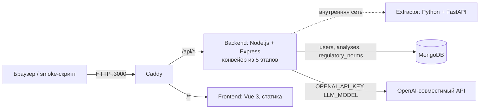

# Optimus — HackAlem AI

ИИ-агент «Анализ организационной структуры и функционала» (задача 1, владелец — Казахтелеком). В интерфейсе решение называется **OrgScope**. Полное ТЗ, критерии и архитектурная спецификация — в [docs/TASK.md](docs/TASK.md).

## Быстрый доступ для жюри

| | |
|---|---|
| **Развёрнутая версия** | [https://hackalem-ai-wg.germanywestcentral.cloudapp.azure.com](https://hackalem-ai-wg.germanywestcentral.cloudapp.azure.com) |
| **Логин** | `demo@example.com` |
| **Пароль** | `demo12345` |

На развёрнутой версии ключ модели уже настроен: анализ запускается без каких-либо ключей и аккаунтов команды. Контрольный комплект документов для загрузки лежит в репозитории: [services/backend/demo/before/redakciya_8.pdf](services/backend/demo/before/redakciya_8.pdf) («до») и [services/backend/demo/after/redakciya_9.pdf](services/backend/demo/after/redakciya_9.pdf) («после»). Пошаговый сценарий — в разделе «Как проверить решение».

Локальный запуск (нужны только Git и Docker):

```bash
git clone https://github.com/BAITC-Hacks/hack-0592591a-optimus.git
cd hack-0592591a-optimus
cp .env.example .env
docker compose up --build -d --wait
```

Интерфейс: [http://localhost:3000](http://localhost:3000), тот же логин и пароль. Для запуска анализа локально в `.env` нужны `OPENAI_API_KEY` и `LLM_MODEL` (см. «Доступ для жюри»); без них работают интерфейс, вход, извлечение текста и 19 проверок smoke-скрипта.

## 1. Краткое описание

При реорганизации сотруднику приходится вручную сопоставлять положения о подразделениях, приказы и оргструктуры «до» и «после» и искать, какие функции потерялись, где они задублировались и где исполнение и контроль оказались в одних руках.

Optimus принимает комплекты документов «до» и «после» реорганизации (Word, PDF, Excel), определяет созданные, сохранённые, реорганизованные и упразднённые подразделения, сопоставляет их функции, находит возможную потерю функций, дублирование, пересечения зон ответственности и признаки конфликта интересов и формирует аналитическое заключение с рекомендациями. Каждый вывод ссылается на документ и пункт и содержит дословную цитату, которую код проверил по тексту источника. Дополнительно функции новой структуры сверяются с законами РК.

Пользователь — сотрудник, проводящий анализ организационных изменений. Все выводы носят рекомендательный характер и требуют проверки ответственным сотрудником: об этом говорят интерфейс и заключение.

## 2. Что реализовано

- **Загрузка комплектов «до» и «после»**: PDF с текстовым слоем, Word (`.docx`), Excel (`.xlsx`, `.xlsm`, `.xls`); до 10 файлов на сторону, до 20 МБ каждый; формат проверяется по содержимому. Необязательное поле `regulations` для законов и стандартов, с которыми нужно сверить функции.
- **Извлечение текста с точным адресом источника** (сервис extractor): для Word — абзац с восстановленной автонумерацией, для PDF — страница и строки, для Excel — лист, строка и ячейки. Фрагменты собираются в пункты вида `5.3.2` и подпункты `5.3.2.а`.
- **Подразделения** (M1): код находит пары «Название (АББР)», модель уточняет вид и подчинённость, код сверяет сторону «до» и «после» по аббревиатурам: `created` / `kept` / `removed`; преемники упразднённых единиц оцениваются моделью по структуре и обязанностям и дают статус `reorganized`.
- **Функции**: модель размечает пункты каждого раздела (исполнители, суть, категория из закрытого списка); цитата функции — текст пункта, модель её не пишет.
- **Сопоставление и отклонения** (M2, M3): точное совпадение текста → лексические и семантические (эмбеддинги) кандидаты → модель-судья. Код выводит `POTENTIAL_LOSS` (возможная потеря, в том числе частичная), `MOVED` (перераспределена), `OVERLAP` (общая и частная норма), `POTENTIAL_DUPLICATION` (дублирование у разных подразделений), `POTENTIAL_CONFLICT` (исполнение аудита и контроль его качества у одного владельца, подтверждается моделью по двум пунктам), `NOTE` (новая норма о конфликте интересов).
- **Проверка источников** (M4): каждая цитата проверяется на вхождение в текст своего пункта с учётом документа и стороны; вывод без подтверждённой цитаты отбрасывается.
- **Заключение и рекомендации** (M5, O3): код собирает русское заключение только из проверенных выводов и цитат: итоги, изменения подразделений, потери, дублирование, конфликты, рекомендации по проверке с привязкой к выводам, список исходных документов, дисклеймер. Экспорт в DOCX, PDF и Markdown.
- **Сверка с законодательством** (O1): функции «после» сопоставляются с нормами трёх законов РК из репозитория и с загруженными `regulations`; модель определяет связь `basis` / `contradicts` / `none`, код цитирует статью и проверяет обе цитаты. Каждая норма показана со статьёй, датой редакции и кнопкой «Открыть на adilet.zan.kz».
- **Защита от неподходящих документов**: инструкция, договор или статья вместо положения останавливают анализ с понятной ошибкой `irrelevant_document` и именем файла.
- **Интерфейс** (Vue 3): вход, две зоны загрузки, ход анализа по пяти этапам, экраны **Обзор · Структура · Потеря функций · Дублирование и конфликты · Заключение · Рекомендации**, полная таблица «Все сопоставления», просмотр текста любого пункта, модуль «Соответствие законодательству», история запусков пользователя, дисклеймер на экране результатов.
- **Аутентификация**: регистрация и вход по email и паролю, сессия в httpOnly-cookie, демо-аккаунт создаётся при старте. API анализа намеренно открыт, чтобы жюри и smoke-скрипт запускали сценарий без аккаунта.
- **Проверки**: [scripts/smoke.sh](scripts/smoke.sh) (33 HTTP-проверки с моделью, 19 без неё, включая контрольный набор), [scripts/clean-test.sh](scripts/clean-test.sh) (чистый клон), [scripts/formats-test.sh](scripts/formats-test.sh) (Word/PDF/Excel через весь конвейер без ключа), тесты backend и extractor.

## 3. Как работает решение

1. Пользователь входит, перетаскивает документы в зоны «До реорганизации» и «После реорганизации» и нажимает «Анализировать».
2. Backend проверяет тип и размер файлов, создаёт запись анализа (`queued`), отвечает `202 {"analysis_id"}` и запускает конвейер в фоне; страница опрашивает `GET /api/analyses/:id` каждые 2 с и показывает этап.
3. **Разбор**: каждый файл уходит в extractor, фрагменты группируются в пункты; модель проверяет, что документ описывает подразделения и их функции.
4. **Структура**: подразделения каждой стороны и их сравнение (`created` / `kept` / `removed` / `reorganized`).
5. **Функции**: модель размечает функции по разделам; цитата — текст пункта.
6. **Сопоставление**: код сопоставляет функции «до» и «после», модель судит только кандидатов; код применяет правила отклонений, проверяет каждую цитату и сверяет функции «после» с законами.
7. **Заключение**: код собирает заключение и рекомендации из проверенных записей. Результат сохраняется в MongoDB и открывается на экране «Обзор»: вывод, распределение функций «до», список «Проверить в первую очередь» с цитатами «до» и «после», схема подразделений, рекомендации.

Принцип: extractor режет, код сопоставляет и считает, модель только размечает и оценивает кандидатов. Все числа на экране считает код. На контрольной паре (два PDF по 25 страниц, около 450 пунктов на сторону) анализ занимает 2–4 минуты и делает около 45–50 обращений к модели.

## 4. Технологии

| Компонент | Технологии | Зачем |
|---|---|---|
| Оркестрация | Docker Compose, один `docker-compose.yml` | Одинаковый запуск у команды, на VM и у жюри |
| Вход | Caddy (`caddy:2-alpine`) | Единственный опубликованный порт: `/api/*` → backend, остальное → frontend; HTTPS на VM |
| Backend | Node.js 22 (`node:22-alpine`), Express 5, zod 4, multer 2, jsonwebtoken 9, драйвер mongodb 6, SDK `openai` 7 | API, конвейер анализа, проверка всех входов и ответов модели схемами |
| Модель | OpenAI-совместимый API: `chat.completions` в режиме JSON и `embeddings`; провайдер, модель и адрес задаются в `.env` | Команда использует `gpt-5.6-terra` и `text-embedding-3-small` (OpenAI) |
| Extractor | Python 3.12 (`python:3.12-slim`), FastAPI, uvicorn, uv; python-docx, pdfplumber, openpyxl, xlrd | Разбор Word, PDF и Excel в фрагменты с точным адресом |
| Frontend | Vue 3, Vite 6, marked 18, docx 9; шрифты Manrope, Golos Text, Lora, Nunito Sans, PT Serif (@fontsource) | Интерфейс; экспорт заключения; без UI-библиотек и внешних CDN |
| База | MongoDB 8 (`mongo:8.0`) | Пользователи, анализы, нормы законодательства |
| Проверки | Bash, `curlimages/curl:8.10.1`, `python:3.12-slim` | Все проверочные команды выполняются в контейнерах |

## 5. Архитектура проекта



- **Caddy** ([Caddyfile](Caddyfile), [services/caddy](services/caddy)) — единственный сервис с портами на хосте (`3000` HTTP, `3443` HTTPS).
- **Backend** ([services/backend](services/backend)) — маршруты `/api/auth/*`, `/api/documents/extract`, `/api/analyses*`, `/api/health`; конвейер [src/pipeline](services/backend/src/pipeline): `clauses.js` → `structure.js` → `extract.js` → `compare.js` (+ `regulatory.js`) → `report.js`; единственная точка обращения к модели — [src/llm.js](services/backend/src/llm.js); промпты — текстовые файлы в [src/prompts](services/backend/src/prompts). При старте создаёт индексы, демо-аккаунт и загружает нормы из `data/regulatory`.
- **Extractor** ([services/extractor](services/extractor)) — внутренний сервис, `POST /extract`; наружу не опубликован, вызывается только backend.
- **Frontend** ([services/frontend](services/frontend)) — статическая сборка Vite, раздаётся Caddy; дизайн-система в [DESIGN_SYSTEM.md](services/frontend/DESIGN_SYSTEM.md).
- **MongoDB** — порт не опубликован, данные в томе `mongo-data`.

У каждого сервиса есть healthcheck; backend стартует после базы и extractor, Caddy — после backend и frontend.

## 6. Установка и запуск

Нужны Git, Docker с плагином Compose (проверено на Docker 27 / Compose 2.31) и Bash для скриптов. На хост больше ничего не ставится: сборка, тесты и проверочные запросы выполняются в контейнерах. Нужен доступ в интернет для образов, npm/PyPI при сборке и обращений к модели.

```bash
git clone https://github.com/BAITC-Hacks/hack-0592591a-optimus.git
cd hack-0592591a-optimus
cp .env.example .env
# для анализа впишите в .env: OPENAI_API_KEY=… и LLM_MODEL=gpt-5.6-terra
docker compose up --build -d --wait
```

Откройте [http://localhost:3000](http://localhost:3000). Порты `3000` и `3443` должны быть свободны (меняются в `.env`).

Переменные окружения ([.env.example](.env.example), приложение стартует с ним как есть):

| Переменная | По умолчанию | Назначение |
|---|---|---|
| `SITE_ADDRESS` | `:80` | Адрес сайта для Caddy. Публичное доменное имя включает автоматический HTTPS |
| `WEB_PORT`, `HTTPS_PORT` | `3000`, `3443` | Порты на хосте |
| `MONGO_URL` | `mongodb://mongo:27017/hackalem` | Подключение backend к MongoDB внутри сети Compose |
| `MAX_UPLOAD_MB` | `20` | Максимальный размер одного документа |
| `AUTH_SECRET` | `dev-only-secret-change-me` | Секрет подписи cookie сессии; значение по умолчанию только для локального запуска |
| `DEMO_USER_EMAIL`, `DEMO_USER_PASSWORD`, `DEMO_USER_NAME` | `demo@example.com`, `demo12345`, `Демо` | Демо-аккаунт, создаётся при старте; пустой пароль отключает |
| `LLM_PROVIDER` | `openai` | `openai` (ключ `OPENAI_API_KEY`) или `nvidia` (ключ `NVIDIA_API_KEY`) |
| `LLM_MODEL` | пусто | **Обязательна для анализа.** Чат-модель с режимом JSON. Пусто: `/api/health` отвечает `"llm":"missing"`, запуск анализа — `503 llm_unavailable` |
| `LLM_BASE_URL` | пусто | Адрес OpenAI-совместимого API; пусто — адрес провайдера по умолчанию |
| `OPENAI_API_KEY` / `NVIDIA_API_KEY` | пусто | **Обязателен для анализа.** В репозиторий не входит |
| `EMBEDDING_MODEL` | пусто | Модель эмбеддингов для семантических кандидатов (команда использует `text-embedding-3-small`). Пусто — кандидаты подбираются лексически, анализ выполняется полностью |

Полезные команды:

```bash
docker compose ps
docker compose logs --tail=100 backend
docker compose down        # остановить, данные сохраняются; -v удаляет данные
```

## 7. Как проверить решение

### 7.1. Сценарий в интерфейсе (контрольный комплект)

1. Откройте [развёрнутую версию](https://hackalem-ai-wg.germanywestcentral.cloudapp.azure.com) или [http://localhost:3000](http://localhost:3000) и войдите: `demo@example.com` / `demo12345`.
2. Перетащите `services/backend/demo/before/redakciya_8.pdf` в зону «До реорганизации», `services/backend/demo/after/redakciya_9.pdf` — в зону «После реорганизации», нажмите «Анализировать». Ход анализа показан по этапам, 2–4 минуты.
3. Ожидаемый результат (эти находки воспроизводились во всех контрольных запусках 23.09.2026; количество функций и второстепенных выводов от запуска к запуску немного меняется, потому что разметку делает модель):
   - **Обзор → Изменения структуры**: созданы ДИТААД и ДОА (после п. 3.4.а и 3.4.б); сохранены БВА, Главный аудитор, ДНМ, ДККМ; реорганизовано Направление внутреннего аудита (до п. 3.5.а) с преемниками ДИТААД и ДОА.
   - **Потеря функций**: право ДККМ формировать группы контроля качества — до п. 5.6.2, цитата «формировать группы контроля качества с привлечением работников БВА…»; предложения ДККМ по внешней оценке — до п. 5.6.3; доведение ДНМ результатов консультационных услуг — до п. 5.7.2 (с эмбеддингами модель находит частичный эквивалент в после п. 2.4.7). Могут быть отмечены ещё несколько пунктов ред. 8, которым модель не нашла эквивалента: они требуют проверки сотрудником.
   - **Дублирование и конфликты**: дублирование — запрос информации у Руководителей Общества у ДНМ и ДККМ (после п. 5.4.3 и 5.5.8); конфликт независимости — ДККМ одновременно проводит проверки (после п. 5.3.x) и контролирует качество аудита (после п. 5.5.2); пересечения общих норм для директоров департаментов (после п. 5.3.x) с частными нормами ДНМ / ДККМ.
   - У каждого вывода — документ, пункт и дословная цитата; строка раскрывается в цитаты «до» и «после», кнопка открывает полный текст пункта.
   - **Заключение**: разделы «Итоги анализа», «Изменения подразделений», потери, дублирование, конфликты, «Рекомендации», «Исходные документы», раздел «Сверка с законодательством» и дисклеймер; кнопки «Скачать DOCX», «Скачать PDF», «Markdown».
   - **Рекомендации → Соответствие законодательству**: нормативные основания, например после п. 1.5 (подчинение Главного аудитора Совету директоров) ↔ ст. 61 Закона «Об акционерных обществах» с цитатой статьи и кнопкой «Открыть на adilet.zan.kz».
4. «История» в шапке показывает запуски пользователя; любой открывается повторно.

### 7.2. Smoke-скрипт

```bash
./scripts/smoke.sh
```

С настроенной моделью — 33 проверки, итог `passed=33 failed=0`, 3–5 минут (выполняется полный демо-анализ через `POST /api/analyses/demo`): состояние сервисов, извлечение PDF и отказ неверного типа, регистрация и вход, демо-анализ до статуса `done`, контрольный набор (`units ДИТААД and ДОА created`, `a unit reorganized into successors`, `POTENTIAL_LOSS at до п. 5.6.2 with its quote`, `POTENTIAL_DUPLICATION после п. 5.4.3 / 5.5.8`, `POTENTIAL_CONFLICT cites после п. 5.5.2`, `every finding has a verified quote`, `conclusion carries the advisory disclaimer`, `O1: legislation check ran on 477 norms…`), отказ инструкции по сборке мебели с `irrelevant_document`, история пользователя, ответы `415` / `422` / `404` на неверный ввод.

Без ключа (`.env.example` как есть) — 19 проверок, итог `passed=19 failed=0`: вместо демо-анализа проверяется ответ `503 llm_unavailable`. При другом порте: `WEB_PORT=3100 ./scripts/smoke.sh`; для развёрнутой версии: `BASE_URL=https://hackalem-ai-wg.germanywestcentral.cloudapp.azure.com ./scripts/smoke.sh`.

### 7.3. Демо-анализ через API

```bash
docker run --rm --add-host=host.docker.internal:host-gateway curlimages/curl:8.10.1 -sS -X POST http://host.docker.internal:3000/api/analyses/demo
```

Ответ `{"analysis_id":"a_…"}`. Подставьте id и повторяйте запрос, пока `status` не станет `done`:

```bash
docker run --rm --add-host=host.docker.internal:host-gateway curlimages/curl:8.10.1 -sS http://host.docker.internal:3000/api/analyses/a_XXXXXXXXXXXX
```

Документ анализа содержит `documents[]` (пункты с текстом и ссылками), `units`, `unit_changes`, `functions`, `matches`, `findings` (у каждого `citations[]` с `doc_id`, `side`, `clause_id`, `ref`, `quote`), `regulatory`, `conclusion_md` и `stats` (в контрольных запусках `clauses_before` = 450, `clauses_after` = 453, `dropped_unverified` = 0, `regulatory_norms` = 477).

### 7.4. Тесты и проверка чистого клона

```bash
docker compose run --rm --no-deps backend node --test       # backend, без ключа: сборка пунктов, структура, сопоставление и отклонения на заглушке модели, проверка цитат, заключение, сверка с законодательством на реальных нормах
docker compose run --rm --no-deps extractor pytest -q       # extractor: автонумерация Word, подпункты, таблицы, Excel, PDF, отказы на неверные файлы
./scripts/formats-test.sh                                    # Word, PDF, Excel и смешанный комплект через весь конвейер без ключа (модель подменяется только в этом тесте)
./scripts/clean-test.sh                                      # чистый клон закоммиченного состояния, .env.example, сборка без кеша на портах 3900/3901, smoke; последняя строка «>> Clean-clone test passed»
```

Ожидаемый итог (проверено в Docker 23.09.2026): backend — `# tests 47`, `# fail 0`; extractor — `28 passed`; smoke без ключа — `passed=19 failed=0`; с ключом — `passed=33 failed=0`.

Чтобы в чистом клоне прошёл и демо-анализ, экспортируйте `OPENAI_API_KEY` и `LLM_MODEL` в окружение перед запуском `clean-test.sh` (Compose подставит их в контейнер).

## 8. Данные и интеграции

- **Контрольный комплект** — два обезличенных PDF «Положение о внутреннем аудите АО „Компания“» по 25 страниц в [services/backend/demo](services/backend/demo): ред. 8 («до», SHA-256 `2257b6fa…17bb1`) и ред. 9 («после», SHA-256 `84eb8e79…fed3a5`). Предоставлены команде 23.09.2026 как демоданные; байты не менялись. Отдельная лицензия в документах не указана. Это входные данные, а не заготовленные ответы: каждый запуск выполняет анализ заново.
- **Модель** — единственная внешняя интеграция во время работы: OpenAI-совместимый API через SDK `openai` (`LLM_PROVIDER`, `LLM_MODEL`, `LLM_BASE_URL`, ключ). Ответы модели не кэшируются.
- **Нормативная база (O1)** — [services/backend/data/regulatory](services/backend/data/regulatory), три действующих закона РК в JSONL, одна запись на статью или пункт, 477 записей, около 1,2 МБ:

  | Файл | Акт | Редакция | Записей |
  |---|---|---|---|
  | `Z030000415_.jsonl` | Закон РК «Об акционерных обществах» | от 13.08.2026 | 291 |
  | `Z1500000410.jsonl` | Закон РК «О противодействии коррупции» | от 13.08.2026 | 116 |
  | `Z1200000550.jsonl` | Закон РК «О Фонде национального благосостояния» | от 13.08.2026 | 70 |

  Источник — ИПС «Әділет» (adilet.zan.kz): тексты собраны скрейпингом заранее подготовленным инструментом команды, взяты только акты со статусом «действует», выгрузка от 23.09.2026; каждая запись хранит ссылку на пункт на adilet.zan.kz. Официальные тексты законов не являются объектами авторского права (ст. 8 п. 1 Закона РК «Об авторском праве и смежных правах»). При старте backend проверяет каждую строку и загружает нормы в коллекцию `regulatory_norms` (идемпотентно; ожидаемая строка в логе — `regulatory norms: 477 pieces from 3 acts`). Кнопка «Открыть на adilet.zan.kz» ведёт на `old.adilet.zan.kz`: 23.09.2026 новая версия сайта не открывала пункт по ссылке. Приложение само к adilet.zan.kz не обращается.
- **База** — MongoDB `hackalem`: `users`, `analyses` (по документу на запуск), `regulatory_norms`. Загруженные файлы обрабатываются в памяти и не сохраняются; в базе остаются пункты, подразделения, функции, сопоставления, выводы и заключение.
- Других внешних сервисов, датасетов и API нет.

## 9. Ограничения

- Анализ требует ключа модели: без `OPENAI_API_KEY` и `LLM_MODEL` запуск отвечает `503 llm_unavailable`; остальное работает.
- Все выводы рекомендательные. Сильно переформулированную функцию модель-судья может не распознать, и она попадёт в «возможную потерю»; в контрольных запусках помимо трёх ожидаемых потерь отмечались ещё несколько пунктов ред. 8. Число функций и второстепенных выводов (`MOVED`, `OVERLAP`) от запуска к запуску немного меняется.
- Без `EMBEDDING_MODEL` кандидаты подбираются лексически: контрольный набор воспроизводится, но переформулированные функции чаще попадают в «возможную потерю».
- Сбой модели после повторных попыток или неполные ответы останавливают анализ с ошибкой (`comparison_incomplete`, `structure_incomplete`, `report_unverified`) вместо неполного результата; интерфейс предлагает запустить заново. Перезапуск сервера прерывает выполняющиеся анализы (`interrupted`).
- Сканированные PDF без текстового слоя не распознаются (OCR нет); `.doc` не поддерживается — пересохраните в `.docx`. Обрезанный или частично нечитаемый документ останавливает анализ (`incomplete_document`).
- Проверка на «неподходящий документ» полагается на модель: положение с нестандартной лексикой в редких случаях может быть отклонено; в сообщении видно, за что.
- O1: встроены три закона в редакции от 13.08.2026; на adilet.zan.kz может действовать более новая редакция. Ищутся основание или возможное расхождение для функций «после»; обратной проверки (норма требует функцию, которой нет ни в одном пункте) нет. O2 (сравнение со структурами других операторов) не реализовано: данных нет. O3 — рекомендации по проверке каждого вида выводов; оптимальная структура автоматически не проектируется.
- Анализ занимает 2–4 минуты на пару документов по 25 страниц и растёт линейно с объёмом; кэша ответов модели нет.
- Аутентификация минимальная: нет восстановления пароля, ограничения попыток и ролей; `AUTH_SECRET` по умолчанию годится только для локального запуска.

## 10. Развёрнутая версия

[https://hackalem-ai-wg.germanywestcentral.cloudapp.azure.com](https://hackalem-ai-wg.germanywestcentral.cloudapp.azure.com) — тот же `docker-compose.yml`, пересобирается при каждом push в `main`; ключ модели и `EMBEDDING_MODEL=text-embedding-3-small` заданы в окружении VM. Проверено 23.09.2026 в 17:40: `/api/health` отвечает `{"status":"ok","db":"ok","llm":"configured"}`, вход демо-аккаунтом работает. Локальный запуск из чистого клона остаётся основным способом проверки.

## Соответствие требованиям ТЗ

| Требование | Статус | Где проверить |
|---|---|---|
| M1. Реорганизованные, сохранённые и созданные подразделения | реализовано | экран «Структура»; smoke `units ДИТААД and ДОА created`, `a unit reorganized into successors` |
| M2. Потеря функций | реализовано | экран «Потеря функций»; smoke `POTENTIAL_LOSS at до п. 5.6.2 with its quote` |
| M3. Дублирование и конфликт интересов | реализовано | экран «Дублирование и конфликты»; smoke `POTENTIAL_DUPLICATION после п. 5.4.3 / 5.5.8`, `POTENTIAL_CONFLICT cites после п. 5.5.2` |
| M4. Источник у каждого вывода | реализовано | цитата и пункт у каждого вывода; smoke `every finding has a verified quote` |
| M5. Аналитическое заключение | реализовано | экран «Заключение», экспорт DOCX/PDF/Markdown; smoke `conclusion carries the advisory disclaimer` |
| O1. Сверка с законодательством | реализовано частично (см. «Ограничения») | модуль «Соответствие законодательству»; smoke `O1: legislation check…` |
| O2. Сравнение с другими операторами | не реализовано | — |
| O3. Рекомендации | реализовано | раздел «Рекомендации» заключения и экран «Рекомендации» |

## Доступ для жюри

- **Без ключей**: развёрнутая версия выше, логин `demo@example.com`, пароль `demo12345`. Аккаунт синтетический, создаётся автоматически при старте backend (локально тоже).
- **Локально**: нужен ключ OpenAI-совместимого API с доступом к чат-модели в режиме JSON: `OPENAI_API_KEY` и `LLM_MODEL` в `.env` (команда проверяла на `gpt-5.6-terra`; `EMBEDDING_MODEL=text-embedding-3-small` необязателен). Ключ команды в репозитории отсутствует; способ передачи ключа жюри команда указывает при сдаче работы.
- API анализа (`/api/analyses`) доступен без входа; вход нужен только для интерфейса и истории.

## Надёжность и безопасность

- Все пять сервисов имеют healthcheck и `restart: unless-stopped`; наружу опубликованы только порты Caddy.
- Каждый вход проверяется: JSON до 1 МБ, файлы до `MAX_UPLOAD_MB`, тип по содержимому до постановки в очередь, строгие zod-схемы тел запросов; extractor отклоняет архивы больше 200 МБ в распакованном виде и PDF больше 300 страниц и разбирает документы в отдельном потоке. Ошибки — JSON `{"error":{"code","message"}}` без трассировок.
- Внешние вызовы с таймаутами и повторами: extractor 60 с и два повтора; модель 90 с, два повтора на сетевые ошибки и 429/5xx, не больше 12 параллельных вызовов, проверка каждого ответа схемой с одним повторным запросом.
- Текст документов передаётся модели как данные внутри блока `<document>` с указанием не выполнять содержащиеся в нём инструкции; модель возвращает только идентификаторы пунктов и метки, цитаты берёт код. Заключение строится кодом.
- Пароли — `scrypt`, сессии — JWT HS256 в cookie `HttpOnly; SameSite=Lax` (`Secure` за HTTPS); в фильтры MongoDB попадают только приведённые значения. Ключи читаются только на сервере и в бандл frontend не попадают; `.env` исключён из Git.

## Сторонние и заранее подготовленные материалы

- До мероприятия подготовлен только шаблон окружения (коммит `a6d411c`, 23.09.2026 10:48): инструкции для агентов, Compose, Caddyfile, шаблоны документации и скрипты проверки. Всё прикладное (extractor, конвейер, API, интерфейс) написано 23.09.2026 в этом репозитории.
- Образы и инфраструктура: Docker/Compose, Caddy, MongoDB, curl, python:3.12-slim, node:22-alpine, uv.
- Backend: express 5, mongodb 6, multer 2, jsonwebtoken 9, zod 4 (MIT/Apache-2.0), openai 7 (Apache-2.0).
- Frontend: vue 3, vite 6, marked 18, docx 9 (MIT); шрифты Manrope, Golos Text, Lora, Nunito Sans, PT Serif из пакетов @fontsource (SIL OFL 1.1). Иконки нарисованы вручную в стиле Lucide. Логотип OrgScope — условный знак, не логотип Казахтелекома.
- Extractor: FastAPI, uvicorn, python-multipart, python-docx, pdfplumber, openpyxl, xlrd, pytest, httpx; полный список — `services/extractor/uv.lock`.
- Модель: `gpt-5.6-terra` и `text-embedding-3-small` (OpenAI) через официальный SDK.
- Данные: два предоставленных обезличенных PDF и тексты трёх законов РК с adilet.zan.kz, выгруженные заранее подготовленным инструментом команды (код инструмента в репозиторий не входит); подробности — в разделе «Данные и интеграции».
- Инструменты разработки: OpenAI Codex, Claude Code и Cursor; инструкции для них — в `AGENTS.md`, `CLAUDE.md` и `.claude/`.

## Команда

Команда Optimus, три участника; авторы коммитов в истории Git — `Khazretsultan`, `kairadio`, `bolatashim`. Распределение: extractor, сборка пунктов, API анализа, сверка с законодательством и smoke — Khazretsultan; модуль модели, этапы конвейера, экран результатов, экспорт и README — kairadio; дизайн-система и экран входа — bolatashim.
