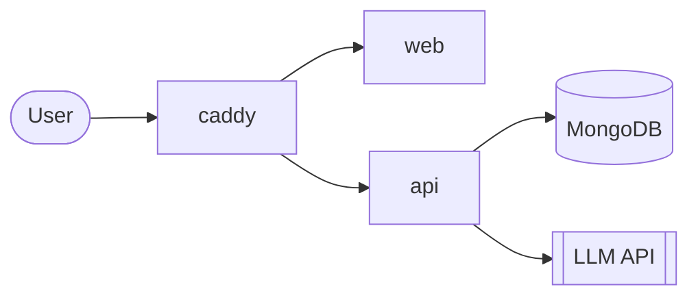

# <Project name>

> One sentence: what it does, for whom, and the result they get.

**Track:** <track> · **Task:** <task number and title> · **Live demo:** https://hackalem-ai-wg.germanywestcentral.cloudapp.azure.com

<!-- Keep this file truthful at every commit. It is the pitch for the technical review, and if reviewers
     cannot launch the project by following it, the team is excluded with no second chance.
     The sections below cover the 8 items the regulation requires; do not remove any.
     Delete these comments and every unused placeholder before the final push. -->

## What it does

<!-- Purpose: 3-5 sentences. The problem, the user, what the product does about it. No marketing prose. -->

## Main scenario

<!-- Numbered steps from input to result, exactly as a reviewer would click through them. -->
1.
2.
3.

### Task requirements coverage

| # | Requirement (from the task specification) | Status | Where in the code |
|---|---|---|---|
| 1 | | done / partial / not done | `services/...` |

## Architecture

<!-- Diagram (Mermaid renders on GitHub) plus one short paragraph per service. -->



## Technology, models and data

| Area | Choice | Why |
|---|---|---|
| Backend | | |
| Frontend | | |
| Database | MongoDB 8 | |
| LLM | <provider / model> | |
| Data | <source, license, synthetic or real; how the demo data is loaded> | |

## Run from scratch

Prerequisites: **Docker** with Compose (Docker Desktop 4.x or Docker Engine 27+). Nothing else is installed on the host; every dependency is inside the images (see the manifests in `services/*`).

```bash
git clone <repo-url> && cd <repo>
cp .env.example .env        # then fill in the values marked "required" below
docker compose up --build
```

Open http://localhost:3000.

| Variable | Required | Default | Purpose |
|---|---|---|---|
| `SITE_ADDRESS` | no | `:80` | `:80` = plain HTTP. A public hostname turns on automatic HTTPS (then set `WEB_PORT=80`, `HTTPS_PORT=443`) |
| `WEB_PORT` | no | `3000` | Host port of the HTTP entrypoint |
| `HTTPS_PORT` | no | `3443` | Host port for HTTPS (only used with a public hostname) |
| `MONGO_URL` | no | `mongodb://mongo:27017/hackalem` | MongoDB connection string inside the compose network |
| `LLM_PROVIDER` | no | `openai` | `openai` or `nvidia` |
| `LLM_MODEL` | for AI features | empty | Model name at the provider |
| `LLM_BASE_URL` | no | empty | Override the provider endpoint (leave empty for the default) |
| `OPENAI_API_KEY` | for AI features | empty | See "Access for reviewers" |
| `NVIDIA_API_KEY` | if `LLM_PROVIDER=nvidia` | empty | See "Access for reviewers" |

## How to verify

```bash
./scripts/smoke.sh
```

<!-- What the script checks, plus sample inputs (path in repo) and the expected outputs, step by step. -->

## Access for reviewers

<!-- Regulation 5.6.6: reviewers must be able to run the main scenario without any team member's account.
     State exactly what they need and where to get it: a test account, a capped reviewer API key, sample data.
     If a credential was submitted through the platform instead, say so here. -->

## Reliability and security

<!-- Input validation, error format, timeouts/retries on the LLM, upload limits, how secrets are handled. -->

## Known limitations

<!-- Be specific and honest. Anything stubbed or partial is listed here. -->

## Third-party and pre-existing materials

- Before the event we prepared only a generic development-environment template (agent instructions in `AGENTS.md`, a Docker Compose skeleton, smoke-test scripts) and provisioned the demo VM. All product code was written during the hackathon.
- Libraries: see the dependency manifests in each `services/*` directory.
- <models, datasets, other external materials, with licenses>

**AI tools used in development:** OpenAI Codex, Claude Code.

## Team

| Member | Built |
|---|---|
| | |
