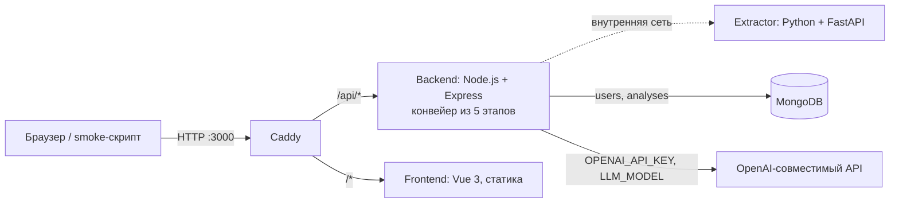

# Optimus — HackAlem AI

## Краткое описание

ИИ-агент для сотрудника, который анализирует организационные изменения. Он принимает комплекты документов «до» и «после» реорганизации (положения о подразделениях, приказы, оргструктуры в Word, PDF или Excel), определяет, какие подразделения созданы, сохранены, реорганизованы или упразднены, сопоставляет их функции, находит возможную потерю функций, дублирование, пересечения зон ответственности и признаки конфликта независимости, и формирует аналитическое заключение. Каждый вывод ссылается на документ и пункт и содержит дословную цитату, проверенную кодом. Задача и критерии — в [docs/TASK.md](docs/TASK.md) (задача 1, владелец — Казахтелеком).

Выводы носят рекомендательный характер и требуют проверки ответственным сотрудником; интерфейс и заключение говорят об этом явно.

Пункты с одинаковыми номерами в разных файлах различаются по `doc_id`; сравнение дублирования выполняется и между файлами. Заключение содержит идентификатор документа в каждой ссылке и список исходных имён файлов. Проверка цитат сохраняет регистр и пунктуацию, допускает только различия в пробелах и проверяет сторону «до/после».

## Что реализовано

- Единый [docker-compose.yml](docker-compose.yml) с сервисами Caddy, backend, extractor, frontend и MongoDB, проверками состояния и постоянными томами.
- **Extractor** ([services/extractor](services/extractor)): внутренний сервис на Python + FastAPI. `POST /extract` принимает файл Word (`.docx`), PDF с текстовым слоем или Excel (`.xlsx`, `.xlsm`, `.xls`) и возвращает упорядоченный список фрагментов с текстом, номером пункта, разделом, точным местом в файле и готовой ссылкой на источник (для Word — абзац с восстановленной автонумерацией, для PDF — страница и строки, для Excel — лист, строка и диапазон ячеек). Формат определяется по содержимому. Наружу сервис не опубликован.
- **Backend** ([services/backend](services/backend)): Node.js + Express. `GET /api/health` — состояние базы и модели (`{"status":"ok","db":"ok","llm":"configured"}`). `POST /api/documents/extract` — извлечение фрагментов из одного файла (отладочный маршрут). `POST /api/auth/*` — регистрация и вход с сессией в httpOnly-cookie. Модуль [extractorClient.js](services/backend/src/extractorClient.js) — единственная точка обращения к extractor (таймаут 60 с, два повтора), [llm.js](services/backend/src/llm.js) — единственная точка обращения к модели (таймаут 90 с, два повтора, режим JSON, проверка ответа zod-схемой с одним повторным запросом при невалидном ответе, не больше 12 параллельных вызовов, типизированная ошибка → `503 llm_unavailable`).
- **Конвейер анализа** ([services/backend/src/pipeline](services/backend/src/pipeline)), пять этапов, как в docs/TASK.md §2–§5:
  1. [clauses.js](services/backend/src/pipeline/clauses.js) — фрагменты extractor → пункты `{doc_id, side, clause_id, parent_id, text, fragment_ids, ref}`; подпункты становятся `5.3.2.а`, склеенные номера разделяются только когда продолжают нумерацию, номера страниц и оглавление отбрасываются. Код, без модели.
  2. [structure.js](services/backend/src/pipeline/structure.js) — подразделения. Код находит пары «Название (АББР)» и раздел о структуре, модель дополняет вид и подчинённость, код отбрасывает подразделение, названия или аббревиатуры которого нет в указанном пункте. Сравнение сторон по аббревиатуре — код (`kept` / `created` / `removed`); модель оценивает возможных функциональных преемников по структуре и обязанностям, после чего единицы получают статус `reorganized`. Это гипотеза о перераспределении, а не юридическое правопреемство. Пропущенный/невалидный ответ или сбой останавливает анализ (`structure_incomplete`), не превращая неопределённость в упразднение.
  3. [extract.js](services/backend/src/pipeline/extract.js) — функции. Модель для каждого раздела размечает пункты: исполнители (аббревиатуры подразделений или должность), формулировка сути и категория из закрытого списка (`perform_audit`, `quality_control`, `plan`, `report`, `method`, `monitor`, `interact`, `other`). Заголовок «Директоры департаментов» код разворачивает на все департаменты. Цитата функции — текст пункта, модель её не пишет.
  4. [compare.js](services/backend/src/pipeline/compare.js) — только совпадение полного нормализованного текста автоматически означает сохранённую функцию. Лексическое сходство и эмбеддинги отбирают кандидатов; различающиеся тексты оценивает модель с учётом отрицаний, сроков и объёма обязанности. Частичное соответствие даёт предупреждение о возможной частичной потере с обеими цитатами, включая слабые положительные оценки. Неуверенный ответ об отсутствии функции останавливает анализ. Затем код выявляет перенос, дублирование, пересечение общей и частной нормы, конфликт исполнения аудита и контроля его качества. Цитаты проверяются по исходным пунктам.
  5. [report.js](services/backend/src/pipeline/report.js) — заключение на русском в Markdown из выводов; ссылки только вида `[до · before_1 · п. X]` / `[после · after_1 · п. Y]`, код удаляет любые другие и добавляет дисклеймер. Если модель недоступна на этом шаге, заключение собирается кодом из выводов.
  Промпты — текстовые файлы в [services/backend/src/prompts](services/backend/src/prompts); текст документов передаётся как данные внутри блока `<document>` с запретом выполнять содержащиеся в нём указания.
- **Сверка с законодательством (опция O1)** ([regulatory.js](services/backend/src/pipeline/regulatory.js)) выполняется внутри этапа 4, сразу после сопоставления. Каждая функция «после» сравнивается с нормами трёх законов РК из [services/backend/data/regulatory](services/backend/data/regulatory) и с пунктами загруженных нормативных документов (поле `regulations`); при равном сходстве загруженные документы идут первыми.
  - **Кандидаты.** Код отбирает до трёх норм-кандидатов: по эмбеддингам, если задан `EMBEDDING_MODEL` (векторы норм кэшируются в MongoDB), иначе по лексическому сходству.
  - **Оценка связи.** Модель (промпт [regulatory.md](services/backend/src/prompts/regulatory.md)) определяет связь: `basis` — норма регулирует функцию, `contradicts` — возможное расхождение, `none` — связи нет. Ответ с выдуманной нормой или с уверенностью ниже 0,6 отклоняется.
  - **Цитаты.** Код сам выбирает дословную строку статьи, ближайшую к функции. Цитата пункта и цитата нормы проверяются на вхождение в свои тексты, иначе вывод отбрасывается.
  - **Результат** — поле `regulatory` анализа: `REGULATORY_BASIS` (нормативное основание) и `POTENTIAL_REGULATORY_CONFLICT` (возможное расхождение). У каждого вывода есть пункт документа «после» с цитатой и норма: статья, цитата, дата редакции и ссылка на этот пункт на adilet.zan.kz. Над дисклеймером заключения код добавляет раздел «Сверка с законодательством».
  - **Надёжность.** Этап не останавливает анализ: без норм или при ошибке `regulatory` пуст, а `stats.regulatory_status` (`ok`, `no_norms`, `failed`) объясняет причину. Норма — основание для проверки, а не юридический вывод.
- **API анализа** ([routes/analyses.js](services/backend/src/routes/analyses.js)), без входа в аккаунт: `POST /api/analyses` (multipart-поля `before` и `after` и необязательное `regulations` с законами и стандартами; до 10 файлов в поле, до `MAX_UPLOAD_MB` МБ; тип проверяется по содержимому) → `202 {"analysis_id"}`; `POST /api/analyses/demo` — то же на встроенной контрольной паре и встроенной нормативной базе; `GET /api/analyses/:id` — документ анализа (`status`, `stage`, `documents[]` с пунктами, `units`, `unit_changes`, `functions`, `matches`, `findings`, `regulatory`, `conclusion_md`, `stats`). Ошибки: `415 unsupported_format`, `413 file_too_large`, `422 missing_side`, `400 empty_file`, `404 not_found`, `503 llm_unavailable` (модель не настроена). Результат хранится в MongoDB, коллекция `analyses`, один документ на запуск. Если запрос пришёл с сессией, к анализу привязывается пользователь (`user_id`), и `GET /api/analyses` (только с сессией, иначе `401`) возвращает **историю его запусков**: до 100 записей, новые первыми, без тяжёлых полей — статус, этап, файлы, ошибка, длительность и сводка (`functions_before`, `losses`, `conflicts`, `duplications`, `units_created`, …); любой запуск открывается по `GET /api/analyses/:id`.
- **Проверка входных документов** ([pipeline/classify.js](services/backend/src/pipeline/classify.js), промпт [classify.md](services/backend/src/prompts/classify.md)): на этапе разбора каждый документ «до» и «после» проверяется одним коротким запросом к модели — описывает ли он подразделения организации и их функции (положение, регламент, приказ, должностная инструкция). Инструкция по сборке, договор, статья или письмо останавливают анализ с `422 irrelevant_document`: в сообщении названы файл, сторона и что это за документ по мнению модели. Защита от ложного отказа: документ, где не меньше половины пунктов называют подразделения или функции, принимается всегда; сбой самой проверки анализ не блокирует (позже сработают `no_functions` / `no_clauses`). Вердикт сохраняется в `documents[].classification`.
- **Frontend** ([services/frontend](services/frontend)): Vue 3 + Vite, статика через Caddy. После входа демо-аккаунтом: две зоны загрузки «до» / «после» с перетаскиванием и кнопка «Анализировать»; ход анализа по пяти этапам (опрос `GET /api/analyses/:id` каждые 2 с). Экраны результатов повторяют дизайн-макет «OrgScope — Org Structure Comparison UI»: вкладки **Обзор · Структура · Потеря функций · Дублирование и конфликты · Заключение · Рекомендации** и кнопка «Экспорт заключения». Результаты показаны по принципу «сначала вывод, потом детали» ([src/results](services/frontend/src/results)): экран **«Обзор»** — карточки «Изменения структуры» (сохранено / реорганизовано / создано / упразднено) и «Выявленные риски» (потеря / дублирование / конфликт), затем — заголовок-вывод и краткое описание, которые код собирает из статистики анализа (без модели), полоса распределения функций «до» (сохранены / переданы / частично / не найдены), список «Проверить в первую очередь» (выводы высокой и средней важности, по одной строке, до семи по умолчанию; строка раскрывается в две цитаты рядом — «до» и «после» — с кнопкой «Открыть пункт»), схема подразделений «до → после» с отметками потерь и конфликтов, рекомендации из заключения и кнопка «Скачать заключение»; экран **«Структура»** — список подразделений со счётчиками, а для выбранного: статус и источник, распределение его функций, разделы «Возможно утрачено», «Конфликт независимости», «Совпадения и пересечения», «Передано другим»; экраны **«Потеря функций»** и **«Дублирование и конфликты»** — те же строки выводов, отфильтрованные по типу; **«Заключение»** (Markdown, скачивание) и **«Рекомендации»** — модули «Рекомендации» (из заключения) и «Соответствие законодательству» (O1). Полная таблица сопоставления (все функции «до» → «после», фильтры, способ сопоставления) открывается по ссылке «Все сопоставления». Любая ссылка на пункт открывает полный текст пункта из сохранённого документа. Кнопка **«История»** в шапке — все запуски пользователя (время, файлы «до» → «после», статус, сводка чисел или причина ошибки); строка открывает анализ, в том числе ещё выполняющийся (опрос продолжается), на стартовой странице показаны пять последних. Отказ конвейера показан карточкой: для неподходящих документов (`irrelevant_document`, `no_clauses`, `incomplete_document`, `no_functions`) — «Документы не подходят для анализа» с именами файлов и кнопкой загрузить другие. Дисклеймер о рекомендательном характере — на экране результатов и в заключении. Токены и шрифты — в [src/styles](services/frontend/src/styles) и [DESIGN_SYSTEM.md](services/frontend/DESIGN_SYSTEM.md).
- **Контрольный комплект** в репозитории и образе backend ([services/backend/demo](services/backend/demo)): два обезличенных PDF «Положение о внутреннем аудите», ред. 8 («до») и ред. 9 («после»).
- Демо-аккаунт для входа в интерфейс (`demo@example.com` / `demo12345`) создаётся при старте backend ([seed.js](services/backend/src/seed.js)).
- [scripts/smoke.sh](scripts/smoke.sh): HTTP-проверки инфраструктуры, извлечения, аутентификации, полного демо-анализа с проверкой контрольного набора и отказов API анализа (28 проверок с настроенной моделью, 18 без неё — см. «Как проверить решение»). [scripts/clean-test.sh](scripts/clean-test.sh): проверка закоммиченного состояния в чистом клоне с настройками из `.env.example`.
- Тесты backend без ключа ([services/backend/test](services/backend/test)): сборка пунктов на фрагменте реального ответа extractor, правила сопоставления/отклонений на заглушке модели и сверка с законодательством на реальных нормах из `data/regulatory`.

## Как работает решение

Основной сценарий:

1. Проверяющий копирует `.env.example` в `.env`, вписывает ключ и имя модели (см. «Доступ для жюри») и запускает Docker Compose. Compose собирает образы и ждёт, пока все пять контейнеров станут healthy.
2. Пользователь открывает `http://localhost:3000/`, входит демо-аккаунтом и перетаскивает свои документы в зоны «До реорганизации» и «После реорганизации» и нажимает «Анализировать». Для проверки контрольного комплекта загрузите PDF из `services/backend/demo/before/` и `services/backend/demo/after/`; smoke-скрипт запускает тот же комплект через API.
3. Frontend отправляет `POST /api/analyses` (или `/demo`). Backend проверяет тип и размер файлов, создаёт документ анализа со статусом `queued`, отвечает `202 {"analysis_id"}` и запускает конвейер в фоне. Страница опрашивает `GET /api/analyses/:id` каждые 2 с и показывает этап: разбор → структура → функции → сопоставление → заключение.
4. Этап 1: каждый файл уходит в extractor, фрагменты группируются в пункты. Этап 2: модель по разделу о структуре называет подразделения каждой стороны, код сверяет их с пунктами и сравнивает стороны; преемники упразднённых единиц — по одному вызову модели. Этап 3: модель размечает функции по разделам (исполнители, суть, категория). Этап 4: код сопоставляет функции «до» и «после», модель судит только кандидатов; код применяет правила отклонений и проверяет каждую цитату по тексту пункта. Этап 5: модель пишет заключение по выводам, код убирает посторонние ссылки и добавляет дисклеймер.
5. Результат сохраняется в MongoDB и показывается на экране «Итог»: заголовок-вывод, распределение функций, список «Проверить в первую очередь» с цитатами по раскрытию, схема подразделений и рекомендации; подробности — на экране подразделения, в заключении и в полной таблице сопоставлений.

На контрольной паре анализ занимает 2–4 минуты и делает около 45–50 обращений к модели (оба документа по 25 страниц, ~450 пунктов и ~240 функций на сторону). Загруженные файлы обрабатываются в памяти и на диск не пишутся; в базе остаются пункты (текст и ссылки), подразделения, функции, сопоставления, выводы и заключение.

## Технологии

- **Docker Compose** — единое окружение для локального запуска, VM и жюри.
- **Caddy**, образ `caddy:2-alpine` — единая точка входа: `/api/*` → backend, остальное → frontend ([Caddyfile](Caddyfile)). Тот же образ раздаёт статику frontend.
- **Node.js 22** (`node:22-alpine`) и **Express 5** — backend API и конвейер анализа. Один язык на backend и frontend.
- **openai 7** (официальный SDK для OpenAI-совместимых API) — вызовы модели из [llm.js](services/backend/src/llm.js): `chat.completions` в режиме JSON и `embeddings`. Провайдер, модель и адрес задаются переменными окружения. Команда использует модель **gpt-5.6-terra** (OpenAI) с `LLM_PROVIDER=openai`; любой OpenAI-совместимый провайдер подключается через `LLM_BASE_URL`.
- **zod 4** — схемы всех ответов модели и итогового документа анализа; **multer 2** — приём multipart; **jsonwebtoken 9** — сессии; пароли — `scrypt` из `node:crypto`.
- **Python 3.12** (`python:3.12-slim`), **FastAPI**, **uvicorn**, **uv** — сервис извлечения текста: **python-docx** (Word), **pdfplumber** (PDF), **openpyxl** и **xlrd** (Excel), **python-multipart**; **pytest** и **httpx** для тестов.
- **Vue 3** и **Vite 6** — frontend, статическая сборка; **marked 18** — рендер заключения из Markdown (HTML в тексте экранируется до разбора); обычный CSS с переменными без UI-библиотек; шрифты **Manrope** (заголовки), **Golos Text** (текст), **Lora** (цитаты из документов), а также Nunito Sans и PT Serif экрана входа — пакеты @fontsource в сборке, без внешних CDN.
- **MongoDB**, образ `mongo:8.0` — коллекции `users` и `analyses`; драйвер `mongodb` 6.21.
- **Bash**, **curl** (`curlimages/curl:8.10.1`) и **python:3.12-slim** — проверочные скрипты; все запросы и проверка JSON выполняются в контейнерах.
- **Git** — получение репозитория и проверка чистого клона.

## Архитектура проекта



Конвейер внутри backend (docs/TASK.md §2): `clauses.js` (extractor + код) → `structure.js` (модель + код) → `extract.js` (модель) → `compare.js` (код + модель-судья) → `report.js` (модель + код). Принцип: extractor режет, код сопоставляет и считает, модель только размечает и пишет заключение; каждая цитата проверяется кодом до выдачи.

**Caddy** — единственный сервис с опубликованными портами (по умолчанию HTTP `3000`, HTTPS `3443`). Проксирует `/api/*` в `backend:8000`, остальное — в `frontend:80`. Корневой `Caddyfile` включён в образ ([services/caddy/Dockerfile](services/caddy/Dockerfile)).

**Backend** — [services/backend/Dockerfile](services/backend/Dockerfile), порт `8000` внутри сети. Зависимости зафиксированы в `package-lock.json`; в образ входят тесты и контрольные PDF. При старте подключается к MongoDB, создаёт индексы (`users.email`, `analyses.created_at`) и демо-аккаунт; healthcheck — `/health` (200 только при успешном `ping` базы).

**Frontend** — двухэтапный образ ([services/frontend/Dockerfile](services/frontend/Dockerfile)): `node:22-alpine` собирает Vite-проект, `caddy:2-alpine` раздаёт `dist/`.

**Extractor** — [services/extractor/Dockerfile](services/extractor/Dockerfile), порт `8001` только внутри сети; разбор выполняется в отдельном потоке, `/health` отвечает во время разбора.

**MongoDB** — порт не опубликован; данные в томе `mongo-data`; backend стартует после того, как база станет healthy.

## Установка и запуск

Нужны Git, Docker с плагином Compose и Bash. Для загрузки репозитория, образов и обращений к модели требуется доступ к сети. На хост ничего, кроме Docker и Git, ставить не нужно.

```bash
git clone https://github.com/BAITC-Hacks/hack-0592591a-optimus.git
cd hack-0592591a-optimus
cp .env.example .env
# впишите в .env ключ и модель: OPENAI_API_KEY=… и LLM_MODEL=gpt-5.6-terra (см. «Доступ для жюри»)
docker compose up --build -d --wait
```

Откройте [локальную страницу](http://localhost:3000). Порты `3000` и `3443` должны быть свободны; при необходимости измените их в `.env`.

Параметры [.env.example](.env.example):

- `SITE_ADDRESS=:80` — адрес сайта для Caddy; обычный HTTP. Публичное доменное имя включает автоматический HTTPS (на VM: `WEB_PORT=80`, `HTTPS_PORT=443`).
- `WEB_PORT=3000`, `HTTPS_PORT=3443` — порты на хосте.
- `MONGO_URL=mongodb://mongo:27017/hackalem` — строка подключения backend к MongoDB внутри сети Compose.
- `MAX_UPLOAD_MB=20` — максимальный размер одного загружаемого документа.
- `AUTH_SECRET` — секрет подписи cookie сессии; значение по умолчанию только для локального запуска.
- `DEMO_USER_EMAIL`, `DEMO_USER_PASSWORD`, `DEMO_USER_NAME` — демо-аккаунт, создаётся при старте, если его нет; пустой пароль отключает создание.
- `LLM_PROVIDER=openai` — `openai` (ключ `OPENAI_API_KEY`) или `nvidia` (ключ `NVIDIA_API_KEY`, адрес `https://integrate.api.nvidia.com/v1` по умолчанию). **Используется.**
- `LLM_MODEL` — имя чат-модели с поддержкой режима JSON, например `gpt-5.6-terra`. **Обязательна для анализа.** Пустое значение: приложение запускается, `/api/health` отвечает `"llm":"missing"`, запуск анализа отвечает `503 llm_unavailable`.
- `LLM_BASE_URL` — адрес OpenAI-совместимого API; пусто — адрес провайдера по умолчанию.
- `OPENAI_API_KEY` / `NVIDIA_API_KEY` — ключ выбранного провайдера. **Обязателен для анализа.** В репозиторий не входит.
- `EMBEDDING_MODEL` — модель эмбеддингов на том же API для семантических кандидатов при сопоставлении (команда использует `text-embedding-3-small`, локально и на VM). В `.env.example` пуста как безопасное значение по умолчанию: тогда кандидаты подбираются лексически, анализ выполняется полностью, `stats.embeddings` = `"unavailable"`; с заданной моделью — `"ok"`.

Состояние и логи:

```bash
docker compose ps
docker compose logs --tail=100 backend
```

В логе backend каждый вызов модели печатается строкой `[llm] <этап>: <мс>, in=<токены> out=<токены>`, а завершение анализа — строкой `[pipeline] a_… done in N s: {…статистика…}`.

Остановка с сохранением данных: `docker compose down`.

## Как проверить решение

Форматы проверяются через весь конвейер без ключа модели: после запуска Compose выполните `./scripts/formats-test.sh`. Скрипт создаёт синтетические Word-документы с абзацами и таблицами, PDF и Excel в контейнере, вызывает настоящий extractor и проверяет подразделения, сохранённую и утраченную функции, цитаты и заключение. Ответы модели подменяются только внутри этого теста; основной API всегда использует настроенную модель.

Проверка одной командой (с ключом в `.env` занимает 3–5 минут, потому что выполняет полный демо-анализ):

```bash
./scripts/smoke.sh
```

Ожидаемый результат с настроенной моделью — 28 успешных проверок, итог `passed=28 failed=0`, код завершения `0`:

- инфраструктура: `backend health`, `mongo reachable`, `frontend is up`, `unknown api route`;
- извлечение: `extract pdf clauses`, `reject unsupported type`, `reject missing file`;
- аутентификация: `signup (or already registered)`, `login`, `reject wrong password`, `reject invalid signup`, `me requires session`, `me with session cookie`, `demo account login`;
- демо-анализ: `demo analysis queued (202)`, `demo analysis done` (ожидание до 12 минут), `demo clause 5.6.2 with its source`;
- контрольный набор (docs/TASK.md §9): `control set: units ДИТААД and ДОА created`, `control set: a unit reorganized into successors`, `control set: POTENTIAL_LOSS at до п. 5.6.2 with its quote`, `control set: POTENTIAL_DUPLICATION после п. 5.4.3 / 5.5.8`, `control set: POTENTIAL_CONFLICT cites после п. 5.5.2`, `every finding has a verified quote`, `conclusion carries the advisory disclaimer`, `O1: legislation check ran on 477 norms; every finding has both quotes and an adilet link`;
- отказы API анализа: `analysis rejects unsupported type (415)`, `analysis rejects a missing side (422)`, `unknown analysis id (404)`, `history requires session`;
- входной фильтр и история (с моделью): инструкция по сборке мебели в PDF принимается на проверку (`202`), запуск завершается `irrelevant_document` с именем файла, `GET /api/analyses` с сессией показывает этот запуск и не показывает чужой.

Без ключа (например, `.env.example` как есть) скрипт печатает `skip demo analysis and control set: LLM not configured`, вместо демо-анализа проверяет ответ `503 llm_unavailable` и завершается с `passed=18 failed=0`. Так проходит `./scripts/clean-test.sh`, если не подставить ключ. Проверки аутентификации используют синтетический аккаунт `smoke@example.com` / `smoke-pass-123`. При другом порте: `WEB_PORT=3100 ./scripts/smoke.sh`.

Демо-анализ через API вручную:

```bash
docker run --rm --add-host=host.docker.internal:host-gateway curlimages/curl:8.10.1 -sS -X POST http://host.docker.internal:3000/api/analyses/demo
```

Ответ — `{"analysis_id":"a_…"}`. Подставьте id и повторяйте запрос, пока `status` не станет `done` (2–4 минуты):

```bash
docker run --rm --add-host=host.docker.internal:host-gateway curlimages/curl:8.10.1 -sS http://host.docker.internal:3000/api/analyses/a_XXXXXXXXXXXX
```

Ожидаемый результат на контрольной паре (ред. 8 → ред. 9). Точные количества функций и второстепенных выводов от запуска к запуску немного меняются, потому что разметку делает модель; перечисленные ниже находки воспроизводились во всех проверочных запусках 23.09.2026:

- `stats.clauses_before` = 450, `stats.clauses_after` = 453; `stats.dropped_unverified` = 0; `stats.embeddings` = `"ok"` при заданном `EMBEDDING_MODEL`, иначе `"unavailable"`.
- `unit_changes`: `created` — ДИТААД (Департамент ИТ-аудита и анализа данных, после п. 3.4.а) и ДОА (Департамент операционного аудита, после п. 3.4.б); `kept` — БВА, Главный аудитор, ДНМ, ДККМ; `reorganized` — Направление внутреннего аудита (до п. 3.5.а) с преемниками ДИТААД и ДОА.
- `findings` типа `POTENTIAL_LOSS`: право ДККМ формировать группы контроля качества (до п. 5.6.2, «формировать группы контроля качества с привлечением работников БВА…», важность высокая), предложения ДККМ по внешней оценке БВА (до п. 5.6.3), доведение ДНМ результатов консультационных услуг (до п. 5.7.2: без эмбеддингов — полная потеря, с эмбеддингами модель находит частичный эквивалент в после п. 2.4.7 и вывод получает важность «средняя» с обеими цитатами), а также несколько других пунктов ред. 8, которым модель не нашла эквивалента (например, из разделов 9 и 12). Каждый такой вывод требует проверки сотрудником.
- `POTENTIAL_DUPLICATION`: запрос информации у Руководителей Общества у ДНМ и ДККМ (после п. 5.4.3 и 5.5.8), прочие поручения Главного аудитора (после п. 5.4.10 и 5.5.10, низкая важность).
- `OVERLAP`: общие нормы для директоров всех департаментов (после п. 5.3.x) и частные нормы ДНМ / ДККМ (после п. 5.4.x, 5.5.x), например 5.3.3 ↔ 5.4.2, 5.3.6 ↔ 5.4.3 и 5.5.8, 5.3.9 ↔ 5.4.6, 5.3.11 ↔ 5.4.8, 5.3.12 ↔ 5.4.9.
- `POTENTIAL_CONFLICT`: ДККМ одновременно организует и проводит проверки (после п. 5.3.x) и контролирует качество внутреннего аудита (после п. 5.5.2); `review.verdict` = `potential_conflict` с объяснением модели.
- `MOVED`: функции Директора направления внутреннего аудита (до п. 5.3.x) перераспределены директорам департаментов (после п. 5.3.x).
- `NOTE`: новая норма о конфликте интересов (после п. 4.4).
- `conclusion_md` — заключение с разделами «Итоги реорганизации», «Возможная потеря функций», «Возможное дублирование и пересечения», «Возможные конфликты», «Рекомендации», затем раздел «Сверка с законодательством» и дисклеймер в конце.
- `regulatory` (опция O1). Прогон на VM 23.09.2026 с эмбеддингами, анализ `a_b55b9a775863`, 212 с:
  - `stats.regulatory_status` = `"ok"`, `regulatory_norms` = 477, `regulatory_dropped_unverified` = 0;
  - 244 функции «после» с нормами-кандидатами, 20 выводов `REGULATORY_BASIS`, 3 ответа модели отклонены;
  - пример: после п. 1.5 (Главный аудитор функционально подчинён Совету директоров) ↔ ст. 61 Закона «Об акционерных обществах», цитата «3. Служба внутреннего аудита непосредственно подчиняется совету директоров и отчитывается перед ним о своей работе.», ссылка `https://adilet.zan.kz/rus/docs/Z030000415_#z713`;
  - пример: после п. 4.4.а (раскрытие потенциального конфликта интересов) ↔ ст. 15 Закона «О противодействии коррупции»;
  - `POTENTIAL_REGULATORY_CONFLICT` в этом прогоне не найдено.

  Количество выводов меняется от запуска к запуску. Во вкладке «Нормативные требования» кнопка каждого вывода открывает статью на `old.adilet.zan.kz` с тем же якорем.

Тесты backend (ключи и запущенные сервисы не нужны):

```bash
docker compose run --rm --no-deps backend node --test
```

[clauses.test.js](services/backend/test/clauses.test.js) проверяет сборку пунктов на фрагменте реального ответа extractor для ред. 9 (склеенные номера, подпункты `5.3.2.а`, номера страниц, оглавление, строки Excel). [compare.test.js](services/backend/test/compare.test.js) проверяет на заглушке модели: точное совпадение без модели и обязательную оценку различающихся текстов, кандидатов по эмбеддингам и решение судьи, сохранение обоих источников при слабом `partial`, отрицания и сужение обязанностей, лексический запасной путь без эмбеддингов и `POTENTIAL_LOSS` с цитатой пункта, `OVERLAP` для общей и частной нормы против `POTENTIAL_DUPLICATION` для равных подразделений, кандидата в конфликт с подтверждением и с отклонением моделью, удаление вывода с подделанной цитатой, удаление посторонних ссылок из заключения и дисклеймер, сравнение подразделений и разворачивание исполнителей. [regulatory.test.js](services/backend/test/regulatory.test.js) проверяет на реальных нормах из `data/regulatory` и заглушке модели:
- все 477 записей действуют и имеют ссылку на adilet.zan.kz;
- строка с ошибкой в файле останавливает загрузку с указанием файла и строки;
- основание и возможное расхождение по ст. 61 Закона «Об акционерных обществах», с дословной цитатой статьи;
- отклонение выдуманной моделью нормы и удаление вывода с подделанной цитатой пункта;
- загруженные нормативные документы идут первыми и не имеют ссылки;
- пустой результат без норм и при ошибке;
- раздел заключения над дисклеймером.

Тесты extractor: `docker compose run --rm --no-deps extractor pytest -q` (автонумерация Word, подпункты, таблицы, Excel, PDF, отказы на неверные файлы, отзывчивость `/health` во время разбора).

Проверка из чистого клона: `./scripts/clean-test.sh` — клонирует закоммиченное состояние во временную директорию, копирует `.env.example`, собирает без кеша на портах `3900`/`3901`, запускает smoke и всё удаляет. Ожидаемая последняя строка: `>> Clean-clone test passed`. Чтобы в чистом клоне прошёл и демо-анализ, впишите ключ в `.env.example` временной копии или экспортируйте `OPENAI_API_KEY` и `LLM_MODEL` в окружение перед запуском (Compose подставляет их в контейнер).

Извлечение текста из своего документа (отладочный маршрут; замените `document.docx` путём к файлу):

```bash
docker run --rm -v "$PWD":/d --add-host=host.docker.internal:host-gateway curlimages/curl:8.10.1 -sS -F "file=@/d/document.docx" http://host.docker.internal:3000/api/documents/extract
```

Ответ: `document` (имя, формат, размер, sha256, заголовок, страницы), `fragments[]` (`id`, `kind`, `text`, `clause`, `marker`, `section`, `location`, `ref`), `text`, `stats`, `warnings`. Ошибки: `400 bad_request`/`empty_file`, `413 file_too_large`, `415 unsupported_format`, `422 unreadable_document`, `503 extractor_unavailable`, `504 extractor_timeout`.

Регистрация и вход через API описаны в [routes/auth.js](services/backend/src/routes/auth.js): `POST /api/auth/signup` `{name,email,password}` → `201 {user}` и cookie, `POST /api/auth/login` → `200`, `GET /api/auth/me` → `200` или `401 unauthorized`, `POST /api/auth/logout` → `204`. Вход нужен только для интерфейса; API анализа открыт.

## Данные и интеграции

- **Контрольный комплект.** В репозитории и образе backend (`/app/demo`) — два обезличенных PDF «Положение о внутреннем аудите АО „Компания“», по 25 страниц: [ред. 8](services/backend/demo/before/redakciya_8.pdf) («до», SHA-256 `2257b6fa007c4d03ae336f556a93434bd7220292c8394bac6f13e190e1017bb1`) и [ред. 9](services/backend/demo/after/redakciya_9.pdf) («после», SHA-256 `84eb8e79a0eccb9e7c0a922e38301b1210bfb4e6d15ac93feacfce5e23fed3a5`). Файлы предоставлены пользователем 23.09.2026 с поручением включить их как демоданные; байты не менялись, изменены только имена. Отдельная лицензия на распространение в документах не указана.
- **Модель.** Единственная внешняя интеграция — OpenAI-совместимый API чат-моделей через SDK `openai` (`LLM_PROVIDER`, `LLM_MODEL`, `LLM_BASE_URL`, ключ). Команда использует `gpt-5.6-terra` и, при заданном `EMBEDDING_MODEL`, `text-embedding-3-small` (около 300 текстов за 5–6 вызовов на пару документов; векторы функций живут только в памяти во время запуска, векторной базы нет). Ответы модели не кэшируются: каждый запуск анализа выполняет все вызовы заново.
- **База.** MongoDB `hackalem`: `users` (email, имя, хеш пароля, дата), `analyses` (по документу на запуск: статус, этап, пункты документов, подразделения, функции, сопоставления, выводы, выводы сверки с законодательством, заключение, статистика) и `regulatory_norms` (нормы из `data/regulatory`, см. ниже). Сами файлы не сохраняются.
- **Нормативная база для сверки с законодательством (опция O1).** В `services/backend/data/regulatory/` лежат тексты трёх действующих законов РК в формате JSONL: одна запись на статью или пункт, всего 477 записей, около 1,2 МБ.

  | Файл | Акт | Редакция | Записей |
  |---|---|---|---|
  | `Z030000415_.jsonl` | Закон РК «Об акционерных обществах» | от 13.08.2026 | 291 |
  | `Z1500000410.jsonl` | Закон РК «О противодействии коррупции» | от 13.08.2026 | 116 |
  | `Z1200000550.jsonl` | Закон РК «О Фонде национального благосостояния» | от 13.08.2026 | 70 |

  Источник — ИПС «Әділет» (adilet.zan.kz); тексты собраны скрейпингом, взяты только акты со статусом «действует», выгрузка от 23.09.2026 (на сайте может действовать более новая редакция). Запись содержит номер статьи и пункта, текст, дату редакции и ссылку на пункт на adilet.zan.kz (`source_url`). Официальные тексты законов не являются объектами авторского права (ст. 8 п. 1 Закона РК «Об авторском праве и смежных правах»).

  Файлы входят в образ backend (`/app/data/regulatory`). При каждом старте backend проверяет каждую строку ([regulatoryNorms.js](services/backend/src/regulatoryNorms.js)): только статус «действует» и только ссылка на adilet.zan.kz. Затем он загружает нормы в MongoDB `regulatory_norms`. Загрузка идемпотентна: есть уникальный индекс по `doc_id` + `chunk_index`, повторный старт ничего не дублирует, а акты, убранные из папки, удаляются из базы. Если строка с ошибкой, в журнале будут файл и номер строки; backend всё равно запускается, а анализ вернёт `regulatory_status: "no_norms"`. Ожидаемая строка в журнале: `regulatory norms: 477 pieces from 3 acts`.
- **Загруженные нормативные документы** (поле `regulations` в `POST /api/analyses`) разбираются на пункты и участвуют в сверке O1 вместе с законами из `data/regulatory`. Ссылки на adilet у них нет: источник — файл и пункт.
- **Бенчмаркинг (опция O2)** не делается: данных о структурах других операторов нет.

## Ограничения

- Ненумерованные абзацы и строки таблиц сохраняются как отдельные цитируемые фрагменты. Excel, плоские пункты и приложения участвуют в извлечении функций. Если extractor сообщает об обрезанном документе или страницах без текста, анализ останавливается с `incomplete_document`; отсутствие распознанных функций «до» даёт `no_functions`; документ не про подразделения и функции (инструкция, договор, статья) — `irrelevant_document` ещё до этапа структуры. Проверка полагается на модель, поэтому положение с нестандартной лексикой в редких случаях может быть отклонено; в сообщении видно, за что.

- Если сравнение моделью недоступно после повторных попыток или модель пропустила обязательные ответы, анализ завершается ошибкой `comparison_incomplete`. Интерфейс предлагает начать заново; сбой не превращается в вывод об утрате функции или отсутствии дублирования.

- Модель обязательна: без ключа и имени модели анализ не запускается (`503 llm_unavailable`), интерфейс и остальные маршруты работают.
- Все выводы рекомендательные. Судья-модель может не распознать сильно переформулированную функцию, тогда она попадёт в «возможную потерю»; в контрольных запусках помимо трёх ожидаемых потерь отмечалось ещё несколько пунктов ред. 8 (например, из раздела 12), которые нужно проверить вручную. Поэтому карточки и заключение всегда содержат «требует проверки ответственным сотрудником».
- С пустым `EMBEDDING_MODEL` (как в `.env.example`) кандидатов для модели-судьи подбирает лексический запасной путь из docs/TASK.md §5; контрольный набор воспроизводится и так, но сильно переформулированная функция может попасть в «возможную потерю». С `EMBEDDING_MODEL=text-embedding-3-small` (так настроено на VM) кандидаты подбираются по эмбеддингам.
- Опциональные требования ТЗ. Для сверки с законодательством (O1) встроены три закона в редакции от 13.08.2026; на adilet.zan.kz может действовать более новая редакция, другие акты можно загрузить в поле `regulations`. Сверка ищет основание или возможное расхождение для функций «после». Обратной проверки нет: случаи, когда норма требует функцию, которой нет ни в одном пункте, не ищутся. Сравнение со структурами других операторов (O2) не делается: данных об этих структурах нет. Рекомендации (O3) — раздел заключения, который пишет модель по выводам. Кнопка «Открыть на adilet.zan.kz» ведёт на `old.adilet.zan.kz`: на 23.09.2026 новая версия сайта работала в тестовом режиме и не открывала пункт по ссылке, а старая открывала. Адрес задан одной константой `ADILET_BASE` в [adilet.js](services/frontend/src/adilet.js).
- Разметка функций делается моделью, поэтому количество функций и второстепенных выводов (`MOVED`, `OVERLAP`) от запуска к запуску немного меняется; контрольные находки проверяются smoke-скриптом; встречались расхождения в оценке реорганизации и дублирования, поэтому результат требует ручной проверки.
- Анализ занимает 2–4 минуты на пару документов по 25 страниц; для больших комплектов время растёт линейно. Кэша ответов модели нет.
- Сканированные PDF без текстового слоя не распознаются (OCR нет); `.doc` не поддерживается — пересохраните в `.docx`.
- Аутентификация минимальная (нет восстановления пароля, ограничения попыток, ролей); API анализа открыт намеренно, чтобы жюри и smoke-скрипт запускали сценарий без аккаунта. `AUTH_SECRET` по умолчанию годится только для локального запуска.
- Теги образов не закреплены по digest; `caddy:2-alpine` не фиксирует minor-версию.

## Развёрнутая версия

Адрес VM из [AGENTS.md](AGENTS.md): [https://hackalem-ai-wg.germanywestcentral.cloudapp.azure.com](https://hackalem-ai-wg.germanywestcentral.cloudapp.azure.com). После push в `main` VM пересобирает те же образы из того же `docker-compose.yml`; ключ модели задан в её окружении, поэтому демо-анализ там доступен без настройки. Проверить: `BASE_URL=https://hackalem-ai-wg.germanywestcentral.cloudapp.azure.com ./scripts/smoke.sh`. Локальный запуск остаётся основным способом проверки.

## Доступ для жюри

Для запуска нужны только репозиторий и Docker. Для основного сценария (анализ) нужен ключ OpenAI-совместимого API с доступом к чат-модели в режиме JSON: впишите в `.env` значения `OPENAI_API_KEY` и `LLM_MODEL` (команда проверяла на `gpt-5.6-terra`); `EMBEDDING_MODEL=text-embedding-3-small` необязателен, но включает семантический подбор кандидатов. Ключ команды в репозитории отсутствует; способ передачи ключа жюри команда указывает при сдаче работы. Без ключа доступны интерфейс, извлечение текста, аутентификация и 18 проверок smoke-скрипта.

Демо-аккаунт для входа в интерфейс (создаётся при старте backend, локально и на VM):

| Поле | Значение |
|---|---|
| Email (логин) | `demo@example.com` |
| Пароль | `demo12345` |

Аккаунт синтетический. API анализа (`/api/analyses`) доступен без входа.

## Надёжность и безопасность

Все пять сервисов имеют healthcheck и политику `unless-stopped`; наружу опубликованы только порты Caddy. Backend принимает JSON не больше 1 МБ, файлы не больше `MAX_UPLOAD_MB`, проверяет тип файла по содержимому до постановки анализа в очередь, скрывает `X-Powered-By` и отвечает на ошибки JSON-объектом `{"error":{"code","message"}}` без трассировки. Extractor отклоняет архивы больше 200 МБ в распакованном виде и PDF больше 300 страниц; разбор идёт в отдельном потоке.

Вызовы модели: один модуль, таймаут 90 с, два повтора с задержкой на сетевые ошибки и 429/5xx, не больше 12 параллельных вызовов, режим JSON, проверка каждого ответа zod-схемой с одним повторным запросом при невалидном ответе; отказ провайдера (401/403/404/5xx) превращается в понятную ошибку анализа. Текст документов передаётся модели как данные внутри блока `<document>` с указанием не выполнять содержащиеся в нём инструкции; модель возвращает только идентификаторы пунктов и метки, цитаты берутся из текста пункта кодом и проверяются как подстрока. Ссылки в заключении, не относящиеся к выводам, удаляются кодом. Ключи читаются только на сервере и в бандл frontend не попадают.

Аутентификация: `scrypt`-хеши паролей, JWT HS256 в cookie `HttpOnly; SameSite=Lax; Secure` за HTTPS, строгие zod-схемы тел запросов, в фильтры MongoDB попадают только приведённые значения. `.env`, `.env.*` (кроме `.env.example`), `*.pem`, `*.key` исключены из Git.

## Сторонние и заранее подготовленные материалы

- Подготовленный до мероприятия шаблон окружения обозначен коммитом `a6d411c` (`chore: development environment template (prepared before the event)`): инструкции агентов, Compose, Caddyfile, шаблоны документации и скрипты проверки. Всё прикладное (extractor, конвейер, API, интерфейс) написано 23.09.2026 в этом репозитории.
- Сторонние компоненты: Docker/Compose, Caddy, MongoDB, curl, python:3.12-slim и их образы.
- Библиотеки backend: express 5 (MIT), mongodb 6 (Apache-2.0), multer 2 (MIT), jsonwebtoken 9 (MIT), zod 4 (MIT), openai 7 (Apache-2.0).
- Библиотеки frontend: vue 3, vite 6, marked 18 (MIT); шрифты Manrope, Golos Text, Lora, Nunito Sans и PT Serif из пакетов @fontsource (SIL Open Font License 1.1). Иконки в `src/Icon.vue` нарисованы вручную в стиле Lucide. Логотип OrgScope — условный знак, не логотип Казахтелекома.
- Библиотеки extractor: FastAPI, uvicorn, python-multipart, python-docx, pdfplumber/pdfminer.six, openpyxl, xlrd, pytest, httpx; полный список — в `services/extractor/uv.lock`.
- Модель: `gpt-5.6-terra` (OpenAI) через официальный SDK; другие модели не используются. Два предоставленных пользователем обезличенных PDF включены без изменений (см. «Данные и интеграции»).
- Тексты трёх законов РК в `services/backend/data/regulatory/` взяты с adilet.zan.kz (ИПС «Әділет»); подробности и правовой статус — в разделе «Данные и интеграции». Выгрузку сделал заранее подготовленный инструмент команды: корпус НПА, собранный до мероприятия; код этого инструмента в репозиторий не входит.
- Инструменты: в репозитории есть инструкции для OpenAI Codex, Claude Code и Cursor. Extractor, сборка пунктов, API анализа и smoke-проверка написаны с помощью Claude Code и OpenAI Codex; модуль модели, этапы 2–5 конвейера, тесты сопоставления, экран результатов и эта редакция README — с помощью Claude Code; дизайн-система и экран входа — с помощью Cursor.

## Команда

Команда Optimus, три участника; авторы коммитов в истории Git — `Khazretsultan`, `kairadio`, `bolatashim`. Распределение: extractor, сборка пунктов, API анализа и smoke — Khazretsultan; модуль модели, этапы 2–5 конвейера, экран результатов, README — kairadio; дизайн-система и экран входа — bolatashim.
